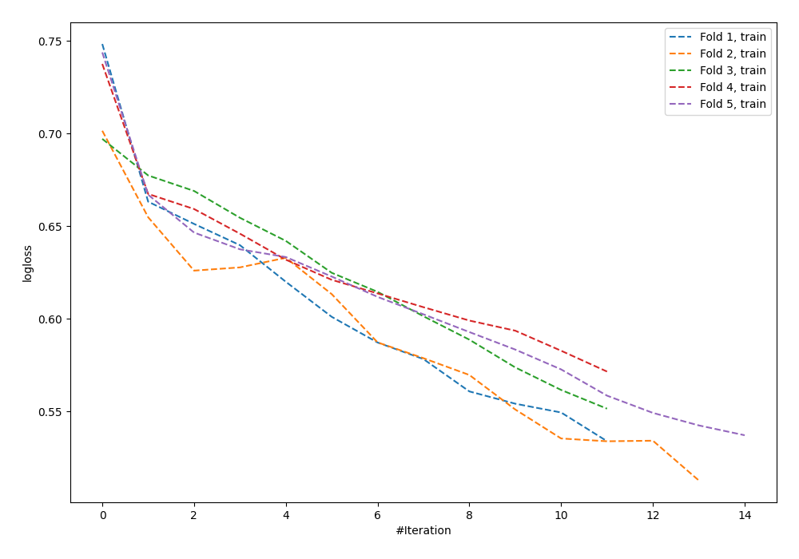

# Summary of 100_NeuralNetwork

[<< Go back](../README.md)

## Neural Network
- **n_jobs**: -1
- **dense_1_size**: 64
- **dense_2_size**: 8
- **learning_rate**: 0.01
- **explain_level**: 0

## Validation
 - **validation_type**: kfold
 - **shuffle**: True
 - **stratify**: True
 - **k_folds**: 5

## Optimized metric
logloss

## Training time

1.9 seconds

## Metric details
|           |    score |   threshold |
|:----------|---------:|------------:|
| logloss   | 0.685821 |  nan        |
| auc       | 0.576383 |  nan        |
| f1        | 0.633094 |    0.309475 |
| accuracy  | 0.56869  |    0.435765 |
| precision | 0.535714 |    0.584231 |
| recall    | 1        |    0.11887  |
| mcc       | 0.165774 |    0.426833 |

## Confusion matrix (at threshold=0.435765)
|                     |   Predicted as negative |   Predicted as positive |
|:--------------------|------------------------:|------------------------:|
| Labeled as negative |                      85 |                      88 |
| Labeled as positive |                      47 |                      93 |

## Learning curves

[<< Go back](../README.md)
