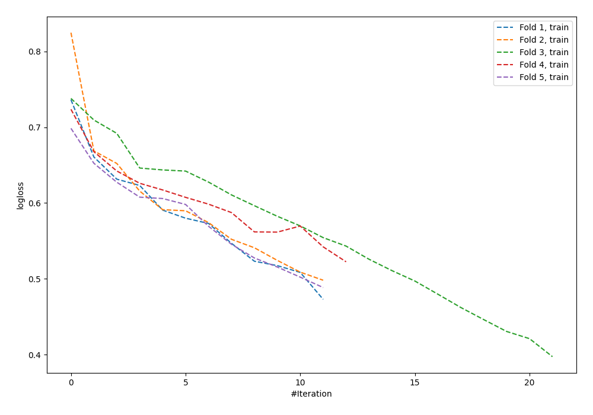

# Summary of 101_NeuralNetwork

[<< Go back](../README.md)

## Neural Network
- **n_jobs**: -1
- **dense_1_size**: 64
- **dense_2_size**: 32
- **learning_rate**: 0.01
- **explain_level**: 0

## Validation
 - **validation_type**: kfold
 - **shuffle**: True
 - **stratify**: True
 - **k_folds**: 5

## Optimized metric
logloss

## Training time

2.1 seconds

## Metric details
|           |     score |   threshold |
|:----------|----------:|------------:|
| logloss   | 0.71289   | nan         |
| auc       | 0.521429  | nan         |
| f1        | 0.618834  |   0.121924  |
| accuracy  | 0.546326  |   0.450731  |
| precision | 0.49      |   0.450731  |
| recall    | 1         |   0.0831638 |
| mcc       | 0.0793391 |   0.264962  |

## Confusion matrix (at threshold=0.450731)
|                     |   Predicted as negative |   Predicted as positive |
|:--------------------|------------------------:|------------------------:|
| Labeled as negative |                     122 |                      51 |
| Labeled as positive |                      91 |                      49 |

## Learning curves

[<< Go back](../README.md)
