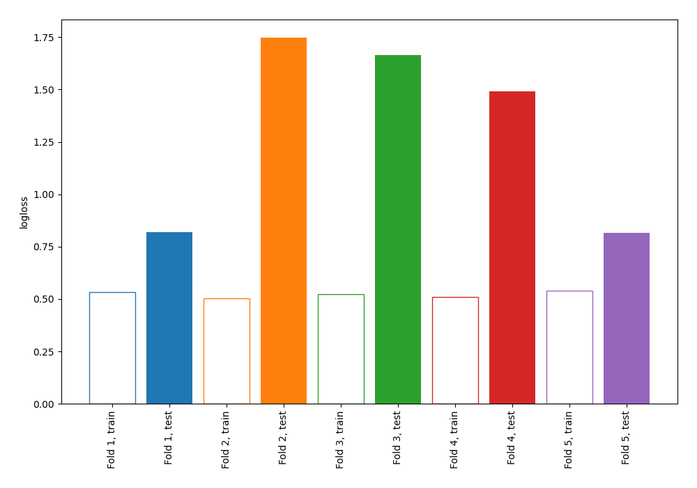

# Summary of 102_DecisionTree

[<< Go back](../README.md)

## Decision Tree
- **n_jobs**: -1
- **criterion**: entropy
- **max_depth**: 3
- **explain_level**: 0

## Validation
 - **validation_type**: kfold
 - **shuffle**: True
 - **stratify**: True
 - **k_folds**: 5

## Optimized metric
logloss

## Training time

0.9 seconds

## Metric details
|           |    score |   threshold |
|:----------|---------:|------------:|
| logloss   | 1.30921  |  nan        |
| auc       | 0.567135 |  nan        |
| f1        | 0.64752  |    0.180851 |
| accuracy  | 0.571885 |    0.321429 |
| precision | 0.5125   |    0.321429 |
| recall    | 0.914286 |    0        |
| mcc       | 0.237823 |    0.321429 |

## Confusion matrix (at threshold=0.321429)
|                     |   Predicted as negative |   Predicted as positive |
|:--------------------|------------------------:|------------------------:|
| Labeled as negative |                      56 |                     117 |
| Labeled as positive |                      17 |                     123 |

## Learning curves

[<< Go back](../README.md)
