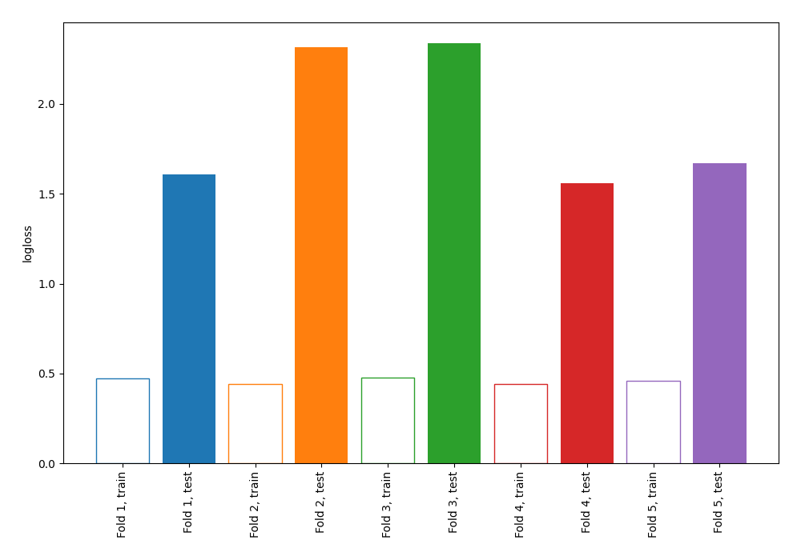

# Summary of 103_DecisionTree

[<< Go back](../README.md)

## Decision Tree
- **n_jobs**: -1
- **criterion**: entropy
- **max_depth**: 4
- **explain_level**: 0

## Validation
 - **validation_type**: kfold
 - **shuffle**: True
 - **stratify**: True
 - **k_folds**: 5

## Optimized metric
logloss

## Training time

0.3 seconds

## Metric details
|           |    score |   threshold |
|:----------|---------:|------------:|
| logloss   | 1.89919  |  nan        |
| auc       | 0.551713 |  nan        |
| f1        | 0.644156 |    0.219101 |
| accuracy  | 0.5623   |    0.219101 |
| precision | 0.506122 |    0.219101 |
| recall    | 0.9      |    0        |
| mcc       | 0.224618 |    0.219101 |

## Confusion matrix (at threshold=0.219101)
|                     |   Predicted as negative |   Predicted as positive |
|:--------------------|------------------------:|------------------------:|
| Labeled as negative |                      52 |                     121 |
| Labeled as positive |                      16 |                     124 |

## Learning curves

[<< Go back](../README.md)
