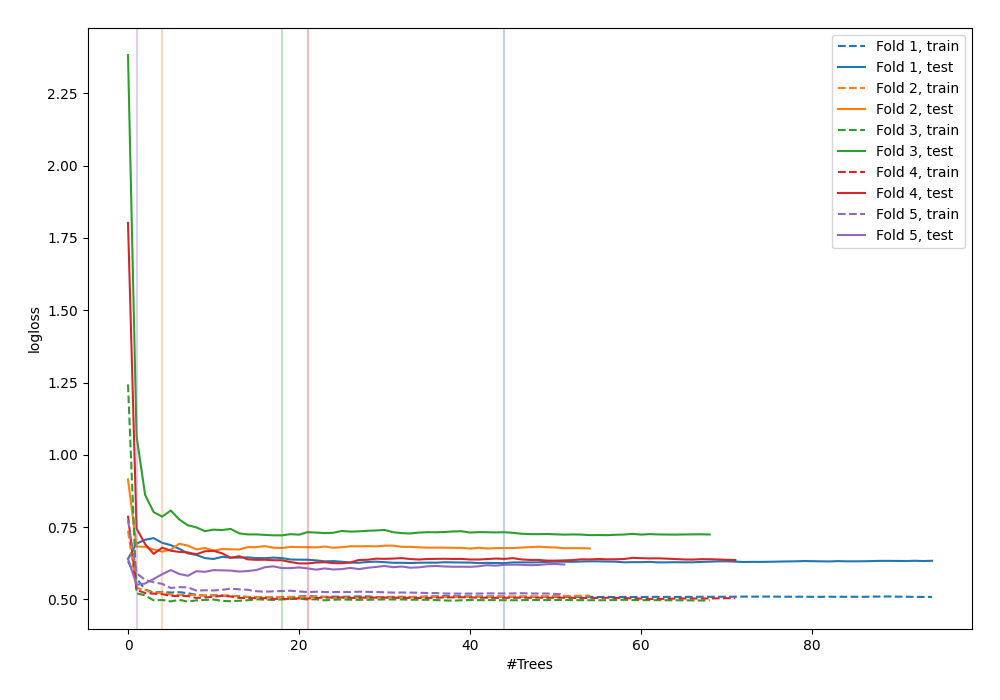

# Summary of 105_RandomForest

[<< Go back](../README.md)

## Random Forest
- **n_jobs**: -1
- **criterion**: entropy
- **max_features**: 0.8
- **min_samples_split**: 50
- **max_depth**: 6
- **explain_level**: 0

## Validation
 - **validation_type**: kfold
 - **shuffle**: True
 - **stratify**: True
 - **k_folds**: 5

## Optimized metric
logloss

## Training time

4.5 seconds

## Metric details
|           |    score |   threshold |
|:----------|---------:|------------:|
| logloss   | 0.63777  |  nan        |
| auc       | 0.684682 |  nan        |
| f1        | 0.6759   |    0.335036 |
| accuracy  | 0.661342 |    0.456385 |
| precision | 0.8      |    0.74465  |
| recall    | 1        |    0.06     |
| mcc       | 0.333184 |    0.456385 |

## Confusion matrix (at threshold=0.456385)
|                     |   Predicted as negative |   Predicted as positive |
|:--------------------|------------------------:|------------------------:|
| Labeled as negative |                     106 |                      67 |
| Labeled as positive |                      39 |                     101 |

## Learning curves

[<< Go back](../README.md)
