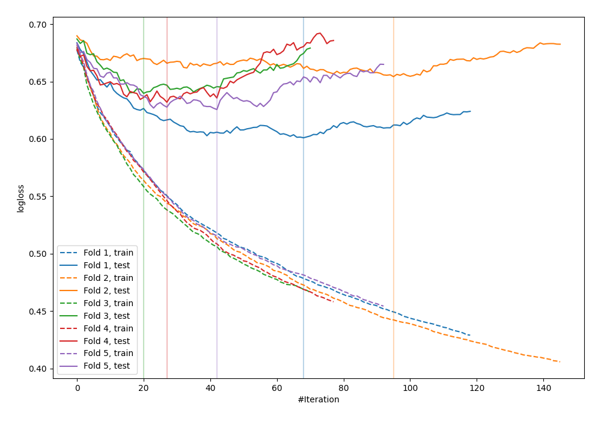

# Summary of 109_Xgboost_SelectedFeatures

[<< Go back](../README.md)

## Extreme Gradient Boosting (Xgboost)
- **n_jobs**: -1
- **objective**: binary:logistic
- **eval_metric**: logloss
- **eta**: 0.075
- **max_depth**: 6
- **min_child_weight**: 5
- **subsample**: 0.6
- **colsample_bytree**: 0.8
- **explain_level**: 0

## Validation
 - **validation_type**: kfold
 - **shuffle**: True
 - **stratify**: True
 - **k_folds**: 5

## Optimized metric
logloss

## Training time

1.3 seconds

## Metric details
|           |    score |   threshold |
|:----------|---------:|------------:|
| logloss   | 0.630512 | nan         |
| auc       | 0.687283 | nan         |
| f1        | 0.660661 |   0.383141  |
| accuracy  | 0.651757 |   0.532223  |
| precision | 0.833333 |   0.764508  |
| recall    | 1        |   0.0853563 |
| mcc       | 0.312869 |   0.383141  |

## Confusion matrix (at threshold=0.532223)
|                     |   Predicted as negative |   Predicted as positive |
|:--------------------|------------------------:|------------------------:|
| Labeled as negative |                     136 |                      37 |
| Labeled as positive |                      72 |                      68 |

## Learning curves

[<< Go back](../README.md)
