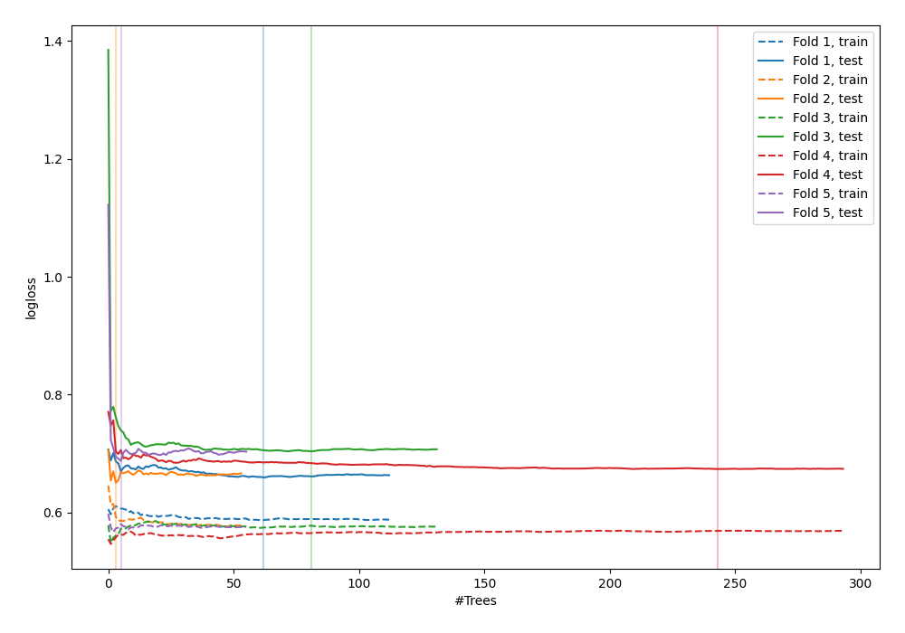

# Summary of 10_Default_ExtraTrees

[<< Go back](../README.md)

## Extra Trees Classifier (Extra Trees)
- **n_jobs**: -1
- **criterion**: gini
- **max_features**: 0.9
- **min_samples_split**: 30
- **max_depth**: 4
- **explain_level**: 0

## Validation
 - **validation_type**: kfold
 - **shuffle**: True
 - **stratify**: True
 - **k_folds**: 5

## Optimized metric
logloss

## Training time

5.5 seconds

## Metric details
|           |    score |   threshold |
|:----------|---------:|------------:|
| logloss   | 0.674884 |  nan        |
| auc       | 0.584414 |  nan        |
| f1        | 0.628019 |    0.321181 |
| accuracy  | 0.600639 |    0.559429 |
| precision | 0.75     |    0.619147 |
| recall    | 1        |    0.165642 |
| mcc       | 0.188086 |    0.559429 |

## Confusion matrix (at threshold=0.559429)
|                     |   Predicted as negative |   Predicted as positive |
|:--------------------|------------------------:|------------------------:|
| Labeled as negative |                     162 |                      11 |
| Labeled as positive |                     114 |                      26 |

## Learning curves

[<< Go back](../README.md)
