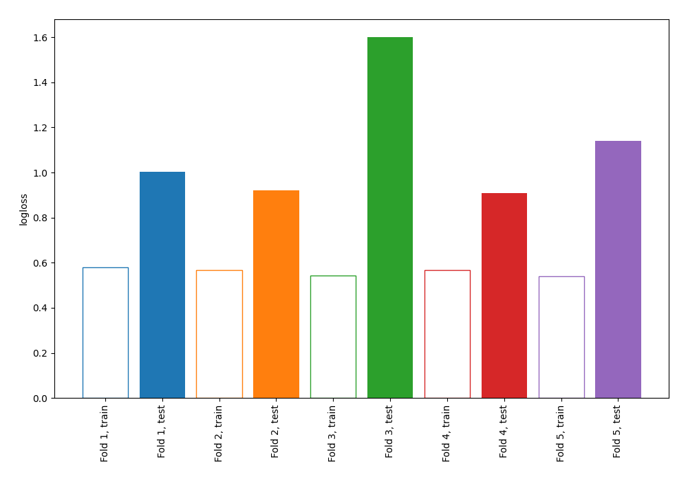

# Summary of 11_Default_NearestNeighbors

[<< Go back](../README.md)

## k-Nearest Neighbors (Nearest Neighbors)
- **n_jobs**: -1
- **n_neighbors**: 5
- **weights**: uniform
- **explain_level**: 0

## Validation
 - **validation_type**: kfold
 - **shuffle**: True
 - **stratify**: True
 - **k_folds**: 5

## Optimized metric
logloss

## Training time

0.8 seconds

## Metric details
|           |     score |   threshold |
|:----------|----------:|------------:|
| logloss   | 1.11559   |       nan   |
| auc       | 0.513976  |       nan   |
| f1        | 0.60771   |         0   |
| accuracy  | 0.552716  |         0.8 |
| precision | 0.5       |         0.8 |
| recall    | 0.957143  |         0   |
| mcc       | 0.0430834 |         0.4 |

## Confusion matrix (at threshold=0.8)
|                     |   Predicted as negative |   Predicted as positive |
|:--------------------|------------------------:|------------------------:|
| Labeled as negative |                     170 |                       3 |
| Labeled as positive |                     137 |                       3 |

## Learning curves

[<< Go back](../README.md)
