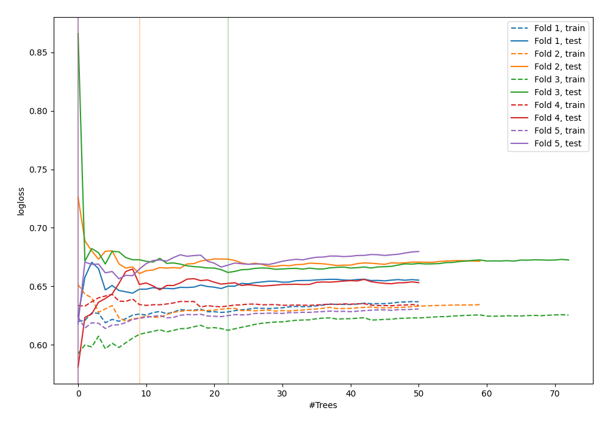

# Summary of 120_ExtraTrees_SelectedFeatures

[<< Go back](../README.md)

## Extra Trees Classifier (Extra Trees)
- **n_jobs**: -1
- **criterion**: gini
- **max_features**: 0.9
- **min_samples_split**: 50
- **max_depth**: 3
- **explain_level**: 0

## Validation
 - **validation_type**: kfold
 - **shuffle**: True
 - **stratify**: True
 - **k_folds**: 5

## Optimized metric
logloss

## Training time

3.5 seconds

## Metric details
|           |    score |   threshold |
|:----------|---------:|------------:|
| logloss   | 0.629375 |  nan        |
| auc       | 0.661396 |  nan        |
| f1        | 0.691689 |    0.40811  |
| accuracy  | 0.632588 |    0.40811  |
| precision | 0.57971  |    0.532278 |
| recall    | 1        |    0        |
| mcc       | 0.365076 |    0.40811  |

## Confusion matrix (at threshold=0.40811)
|                     |   Predicted as negative |   Predicted as positive |
|:--------------------|------------------------:|------------------------:|
| Labeled as negative |                      69 |                     104 |
| Labeled as positive |                      11 |                     129 |

## Learning curves

[<< Go back](../README.md)
