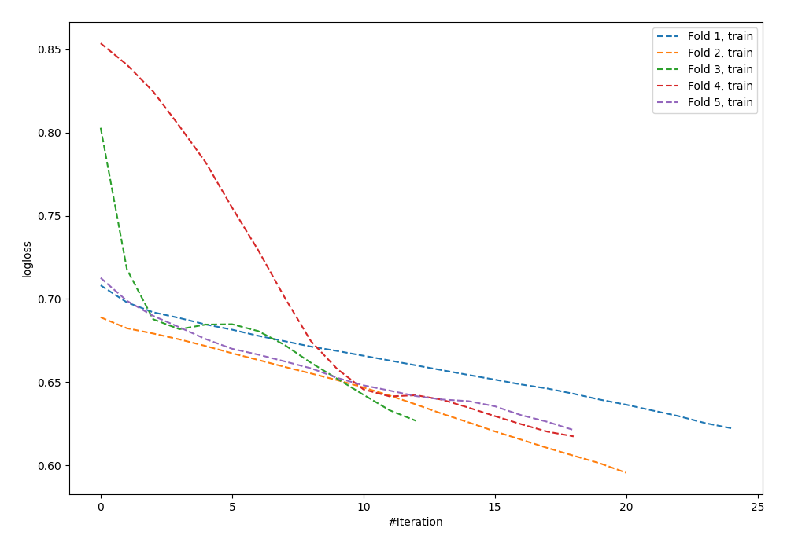

# Summary of 122_NeuralNetwork_SelectedFeatures

[<< Go back](../README.md)

## Neural Network
- **n_jobs**: -1
- **dense_1_size**: 16
- **dense_2_size**: 4
- **learning_rate**: 0.01
- **explain_level**: 0

## Validation
 - **validation_type**: kfold
 - **shuffle**: True
 - **stratify**: True
 - **k_folds**: 5

## Optimized metric
logloss

## Training time

1.1 seconds

## Metric details
|           |    score |   threshold |
|:----------|---------:|------------:|
| logloss   | 0.676771 | nan         |
| auc       | 0.595252 | nan         |
| f1        | 0.632653 |   0.426678  |
| accuracy  | 0.600639 |   0.530539  |
| precision | 0.597403 |   0.530539  |
| recall    | 1        |   0.0357729 |
| mcc       | 0.188304 |   0.436638  |

## Confusion matrix (at threshold=0.530539)
|                     |   Predicted as negative |   Predicted as positive |
|:--------------------|------------------------:|------------------------:|
| Labeled as negative |                     142 |                      31 |
| Labeled as positive |                      94 |                      46 |

## Learning curves

[<< Go back](../README.md)
