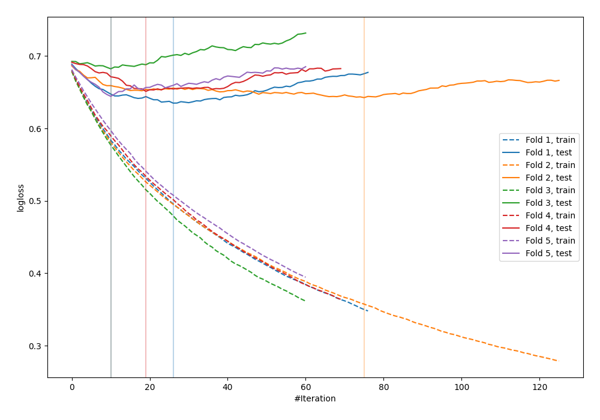

# Summary of 12_Xgboost

[<< Go back](../README.md)

## Extreme Gradient Boosting (Xgboost)
- **n_jobs**: -1
- **objective**: binary:logistic
- **eval_metric**: logloss
- **eta**: 0.05
- **max_depth**: 8
- **min_child_weight**: 5
- **subsample**: 1.0
- **colsample_bytree**: 1.0
- **explain_level**: 0

## Validation
 - **validation_type**: kfold
 - **shuffle**: True
 - **stratify**: True
 - **k_folds**: 5

## Optimized metric
logloss

## Training time

1.3 seconds

## Metric details
|           |    score |   threshold |
|:----------|---------:|------------:|
| logloss   | 0.65106  | nan         |
| auc       | 0.649752 | nan         |
| f1        | 0.661538 |   0.343887  |
| accuracy  | 0.623003 |   0.453689  |
| precision | 0.6875   |   0.694511  |
| recall    | 1        |   0.0971683 |
| mcc       | 0.275304 |   0.343887  |

## Confusion matrix (at threshold=0.453689)
|                     |   Predicted as negative |   Predicted as positive |
|:--------------------|------------------------:|------------------------:|
| Labeled as negative |                     101 |                      72 |
| Labeled as positive |                      46 |                      94 |

## Learning curves

[<< Go back](../README.md)
