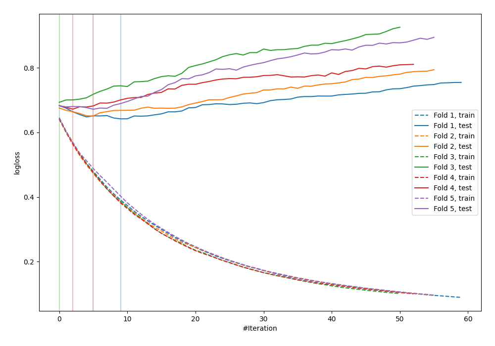

# Summary of 13_Xgboost

[<< Go back](../README.md)

## Extreme Gradient Boosting (Xgboost)
- **n_jobs**: -1
- **objective**: binary:logistic
- **eval_metric**: logloss
- **eta**: 0.1
- **max_depth**: 8
- **min_child_weight**: 1
- **subsample**: 1.0
- **colsample_bytree**: 1.0
- **explain_level**: 0

## Validation
 - **validation_type**: kfold
 - **shuffle**: True
 - **stratify**: True
 - **k_folds**: 5

## Optimized metric
logloss

## Training time

1.6 seconds

## Metric details
|           |    score |   threshold |
|:----------|---------:|------------:|
| logloss   | 0.666074 |  nan        |
| auc       | 0.624546 |  nan        |
| f1        | 0.63285  |    0.353726 |
| accuracy  | 0.607029 |    0.605485 |
| precision | 0.685714 |    0.614839 |
| recall    | 1        |    0.182584 |
| mcc       | 0.197459 |    0.605485 |

## Confusion matrix (at threshold=0.605485)
|                     |   Predicted as negative |   Predicted as positive |
|:--------------------|------------------------:|------------------------:|
| Labeled as negative |                     158 |                      15 |
| Labeled as positive |                     108 |                      32 |

## Learning curves

[<< Go back](../README.md)
