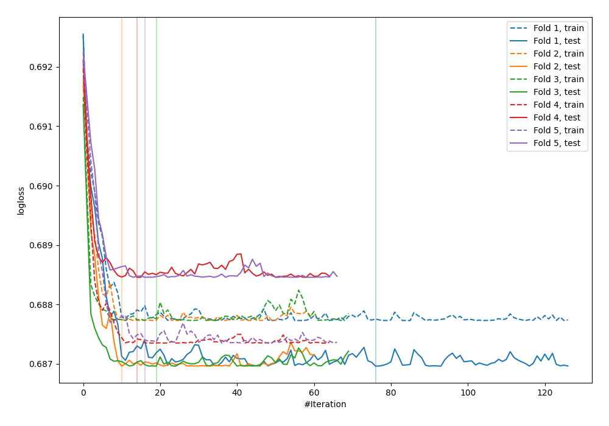

# Summary of 17_Xgboost

[<< Go back](../README.md)

## Extreme Gradient Boosting (Xgboost)
- **n_jobs**: -1
- **objective**: binary:logistic
- **eval_metric**: logloss
- **eta**: 0.15
- **max_depth**: 4
- **min_child_weight**: 25
- **subsample**: 0.7
- **colsample_bytree**: 0.7
- **explain_level**: 0

## Validation
 - **validation_type**: kfold
 - **shuffle**: True
 - **stratify**: True
 - **k_folds**: 5

## Optimized metric
logloss

## Training time

0.5 seconds

## Metric details
|           |      score |   threshold |
|:----------|-----------:|------------:|
| logloss   | 0.687554   |  nan        |
| auc       | 0.503468   |  nan        |
| f1        | 0.618102   |    0.399653 |
| accuracy  | 0.533546   |    0.451634 |
| precision | 0.451613   |    0.448081 |
| recall    | 1          |    0.399653 |
| mcc       | 0.00705148 |    0.448081 |

## Confusion matrix (at threshold=0.451634)
|                     |   Predicted as negative |   Predicted as positive |
|:--------------------|------------------------:|------------------------:|
| Labeled as negative |                     139 |                      34 |
| Labeled as positive |                     112 |                      28 |

## Learning curves

[<< Go back](../README.md)
