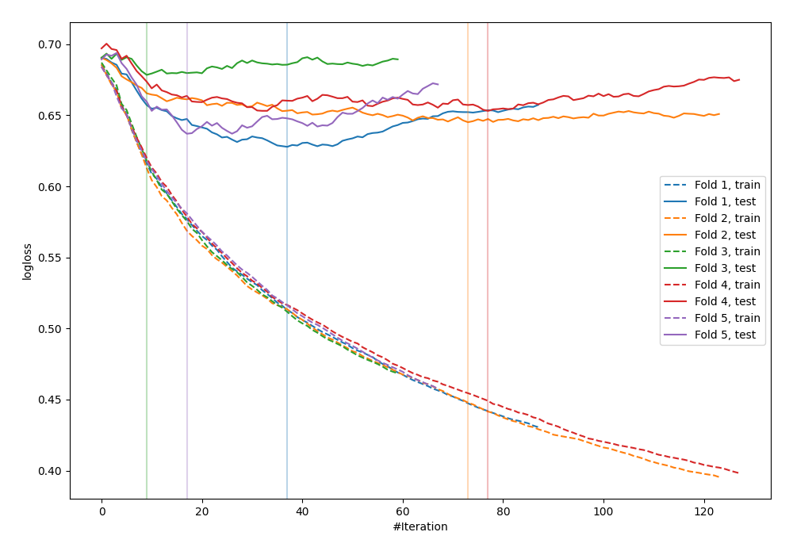

# Summary of 19_Xgboost

[<< Go back](../README.md)

## Extreme Gradient Boosting (Xgboost)
- **n_jobs**: -1
- **objective**: binary:logistic
- **eval_metric**: logloss
- **eta**: 0.075
- **max_depth**: 8
- **min_child_weight**: 10
- **subsample**: 1.0
- **colsample_bytree**: 0.7
- **explain_level**: 0

## Validation
 - **validation_type**: kfold
 - **shuffle**: True
 - **stratify**: True
 - **k_folds**: 5

## Optimized metric
logloss

## Training time

1.5 seconds

## Metric details
|           |    score |   threshold |
|:----------|---------:|------------:|
| logloss   | 0.648309 | nan         |
| auc       | 0.656049 | nan         |
| f1        | 0.645349 |   0.396845  |
| accuracy  | 0.626198 |   0.472641  |
| precision | 1        |   0.833067  |
| recall    | 1        |   0.0759723 |
| mcc       | 0.266932 |   0.404096  |

## Confusion matrix (at threshold=0.472641)
|                     |   Predicted as negative |   Predicted as positive |
|:--------------------|------------------------:|------------------------:|
| Labeled as negative |                     113 |                      60 |
| Labeled as positive |                      57 |                      83 |

## Learning curves

[<< Go back](../README.md)
