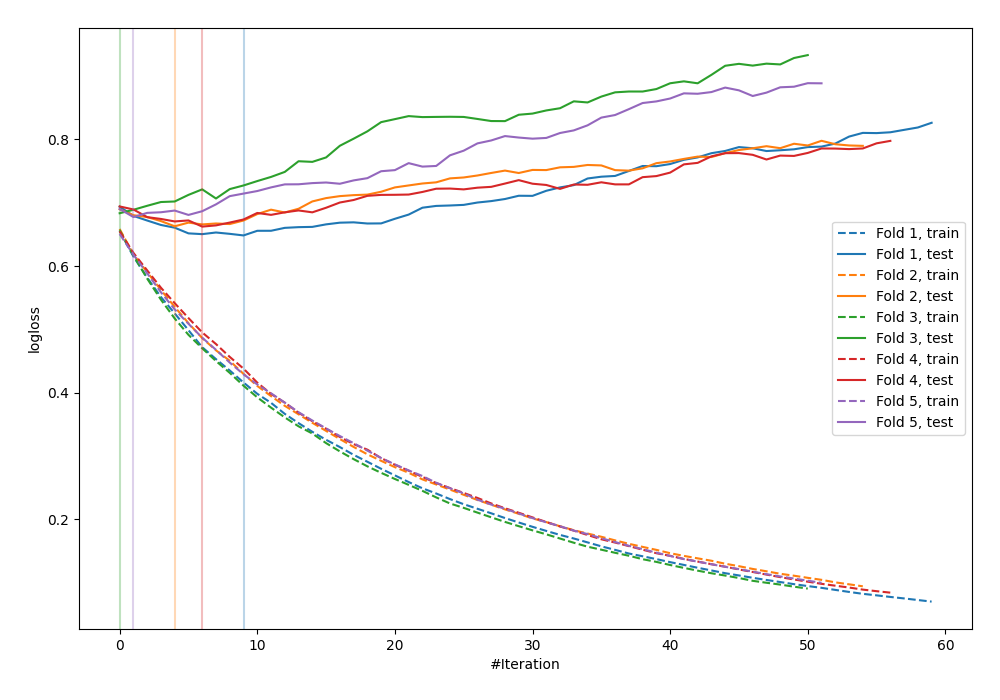

# Summary of 21_LightGBM

[<< Go back](../README.md)

## LightGBM
- **n_jobs**: -1
- **objective**: binary
- **metric**: binary_logloss
- **num_leaves**: 15
- **learning_rate**: 0.1
- **feature_fraction**: 0.8
- **bagging_fraction**: 0.8
- **min_data_in_leaf**: 10
- **explain_level**: 0

## Validation
 - **validation_type**: kfold
 - **shuffle**: True
 - **stratify**: True
 - **k_folds**: 5

## Optimized metric
logloss

## Training time

0.9 seconds

## Metric details
|           |    score |   threshold |
|:----------|---------:|------------:|
| logloss   | 0.666882 |  nan        |
| auc       | 0.609063 |  nan        |
| f1        | 0.638821 |    0.356432 |
| accuracy  | 0.584665 |    0.474382 |
| precision | 0.681818 |    0.607626 |
| recall    | 1        |    0.191739 |
| mcc       | 0.191914 |    0.356432 |

## Confusion matrix (at threshold=0.474382)
|                     |   Predicted as negative |   Predicted as positive |
|:--------------------|------------------------:|------------------------:|
| Labeled as negative |                     123 |                      50 |
| Labeled as positive |                      80 |                      60 |

## Learning curves

[<< Go back](../README.md)
