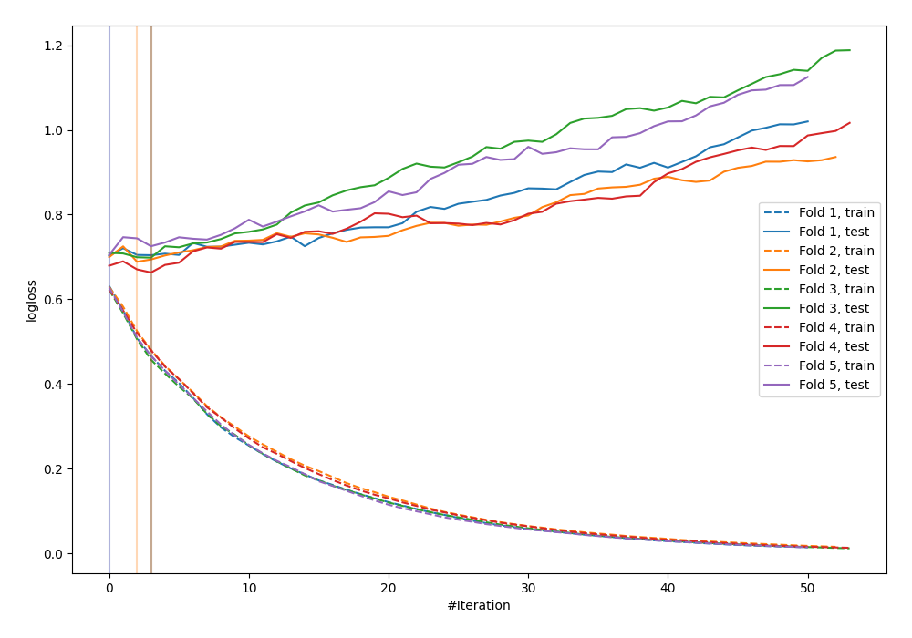

# Summary of 22_LightGBM

[<< Go back](../README.md)

## LightGBM
- **n_jobs**: -1
- **objective**: binary
- **metric**: binary_logloss
- **num_leaves**: 63
- **learning_rate**: 0.2
- **feature_fraction**: 0.5
- **bagging_fraction**: 1.0
- **min_data_in_leaf**: 10
- **explain_level**: 0

## Validation
 - **validation_type**: kfold
 - **shuffle**: True
 - **stratify**: True
 - **k_folds**: 5

## Optimized metric
logloss

## Training time

0.8 seconds

## Metric details
|           |     score |   threshold |
|:----------|----------:|------------:|
| logloss   | 0.691714  |  nan        |
| auc       | 0.539121  |  nan        |
| f1        | 0.619385  |    0.337193 |
| accuracy  | 0.5623    |    0.580753 |
| precision | 0.578947  |    0.591353 |
| recall    | 1         |    0.181526 |
| mcc       | 0.0964453 |    0.337193 |

## Confusion matrix (at threshold=0.580753)
|                     |   Predicted as negative |   Predicted as positive |
|:--------------------|------------------------:|------------------------:|
| Labeled as negative |                     163 |                      10 |
| Labeled as positive |                     127 |                      13 |

## Learning curves

[<< Go back](../README.md)
