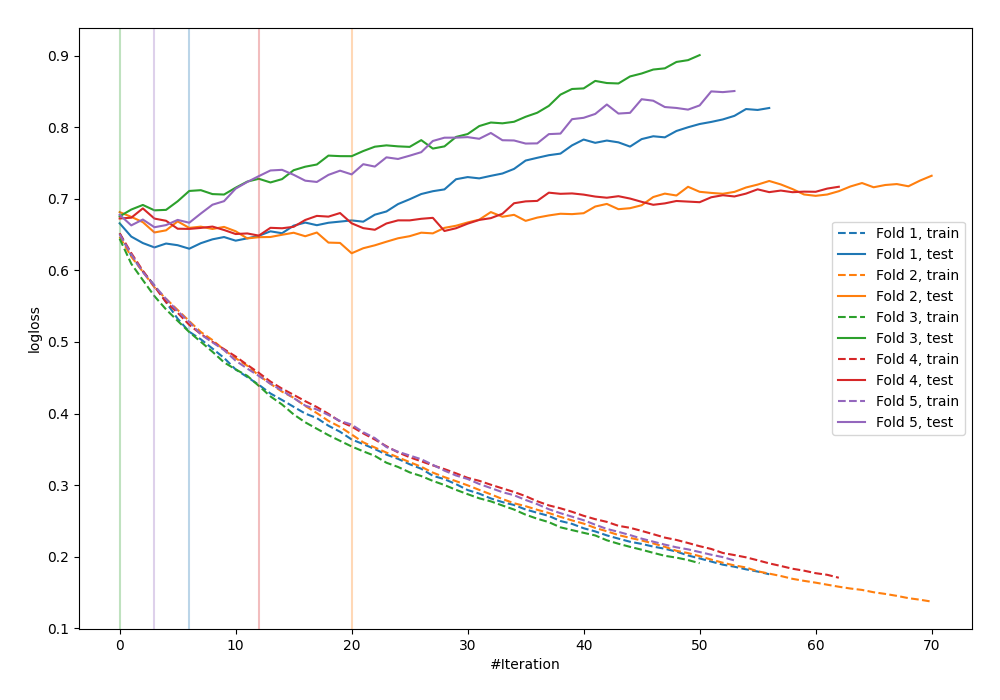

# Summary of 23_LightGBM

[<< Go back](../README.md)

## LightGBM
- **n_jobs**: -1
- **objective**: binary
- **metric**: binary_logloss
- **num_leaves**: 95
- **learning_rate**: 0.2
- **feature_fraction**: 0.9
- **bagging_fraction**: 1.0
- **min_data_in_leaf**: 30
- **explain_level**: 0

## Validation
 - **validation_type**: kfold
 - **shuffle**: True
 - **stratify**: True
 - **k_folds**: 5

## Optimized metric
logloss

## Training time

0.9 seconds

## Metric details
|           |    score |   threshold |
|:----------|---------:|------------:|
| logloss   | 0.647677 | nan         |
| auc       | 0.652808 | nan         |
| f1        | 0.653563 |   0.277941  |
| accuracy  | 0.613419 |   0.549438  |
| precision | 0.705882 |   0.70318   |
| recall    | 1        |   0.0697759 |
| mcc       | 0.246357 |   0.277941  |

## Confusion matrix (at threshold=0.549438)
|                     |   Predicted as negative |   Predicted as positive |
|:--------------------|------------------------:|------------------------:|
| Labeled as negative |                     146 |                      27 |
| Labeled as positive |                      94 |                      46 |

## Learning curves

[<< Go back](../README.md)
