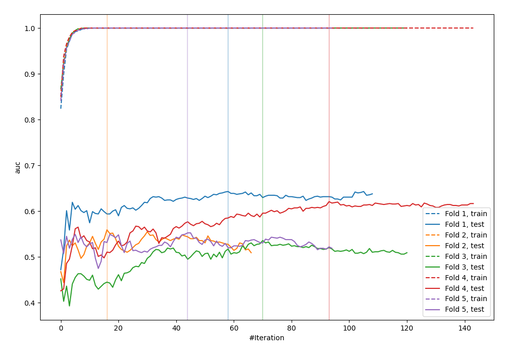

# Summary of 24_LightGBM

[<< Go back](../README.md)

## LightGBM
- **n_jobs**: -1
- **objective**: binary
- **metric**: auc
- **num_leaves**: 31
- **learning_rate**: 0.2
- **feature_fraction**: 0.5
- **bagging_fraction**: 0.8
- **min_data_in_leaf**: 10
- **explain_level**: 0

## Validation
 - **validation_type**: kfold
 - **shuffle**: True
 - **stratify**: True
 - **k_folds**: 5

## Optimized metric
logloss

## Training time

1.1 seconds

## Metric details
|           |    score |     threshold |
|:----------|---------:|--------------:|
| logloss   | 1.10859  | nan           |
| auc       | 0.577044 | nan           |
| f1        | 0.626728 |   0.0054666   |
| accuracy  | 0.578275 |   0.565746    |
| precision | 0.6875   |   0.977472    |
| recall    | 1        |   4.41853e-05 |
| mcc       | 0.181185 |   0.180993    |

## Confusion matrix (at threshold=0.565746)
|                     |   Predicted as negative |   Predicted as positive |
|:--------------------|------------------------:|------------------------:|
| Labeled as negative |                     118 |                      55 |
| Labeled as positive |                      77 |                      63 |

## Learning curves

[<< Go back](../README.md)
