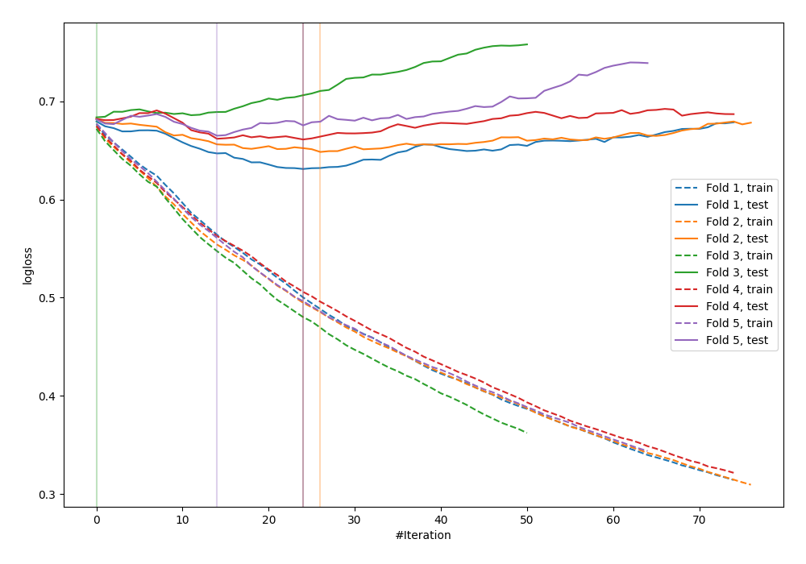

# Summary of 26_LightGBM

[<< Go back](../README.md)

## LightGBM
- **n_jobs**: -1
- **objective**: binary
- **metric**: binary_logloss
- **num_leaves**: 127
- **learning_rate**: 0.05
- **feature_fraction**: 0.5
- **bagging_fraction**: 0.5
- **min_data_in_leaf**: 20
- **explain_level**: 0

## Validation
 - **validation_type**: kfold
 - **shuffle**: True
 - **stratify**: True
 - **k_folds**: 5

## Optimized metric
logloss

## Training time

0.8 seconds

## Metric details
|           |    score |   threshold |
|:----------|---------:|------------:|
| logloss   | 0.657782 |  nan        |
| auc       | 0.639988 |  nan        |
| f1        | 0.65641  |    0.356313 |
| accuracy  | 0.619808 |    0.452078 |
| precision | 0.666667 |    0.678606 |
| recall    | 1        |    0.166228 |
| mcc       | 0.259278 |    0.356313 |

## Confusion matrix (at threshold=0.452078)
|                     |   Predicted as negative |   Predicted as positive |
|:--------------------|------------------------:|------------------------:|
| Labeled as negative |                     109 |                      64 |
| Labeled as positive |                      55 |                      85 |

## Learning curves

[<< Go back](../README.md)
