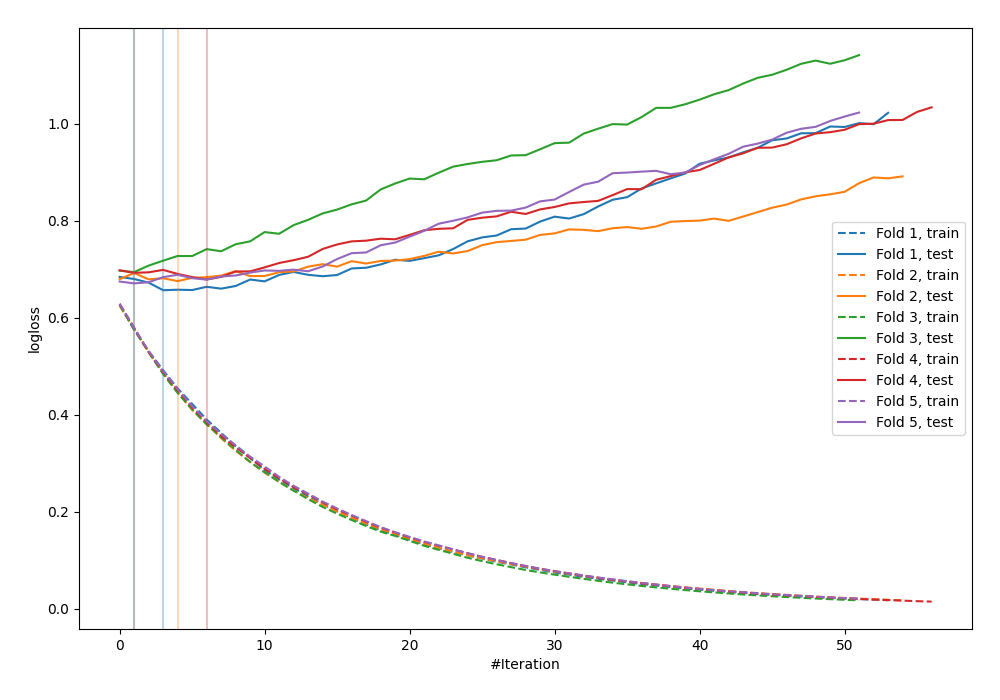

# Summary of 28_LightGBM

[<< Go back](../README.md)

## LightGBM
- **n_jobs**: -1
- **objective**: binary
- **metric**: binary_logloss
- **num_leaves**: 31
- **learning_rate**: 0.1
- **feature_fraction**: 0.8
- **bagging_fraction**: 0.8
- **min_data_in_leaf**: 5
- **explain_level**: 0

## Validation
 - **validation_type**: kfold
 - **shuffle**: True
 - **stratify**: True
 - **k_folds**: 5

## Optimized metric
logloss

## Training time

1.3 seconds

## Metric details
|           |    score |   threshold |
|:----------|---------:|------------:|
| logloss   | 0.675103 |  nan        |
| auc       | 0.582391 |  nan        |
| f1        | 0.626506 |    0.33054  |
| accuracy  | 0.597444 |    0.547291 |
| precision | 1        |    0.687733 |
| recall    | 1        |    0.188488 |
| mcc       | 0.185506 |    0.415084 |

## Confusion matrix (at threshold=0.547291)
|                     |   Predicted as negative |   Predicted as positive |
|:--------------------|------------------------:|------------------------:|
| Labeled as negative |                     156 |                      17 |
| Labeled as positive |                     109 |                      31 |

## Learning curves

[<< Go back](../README.md)
