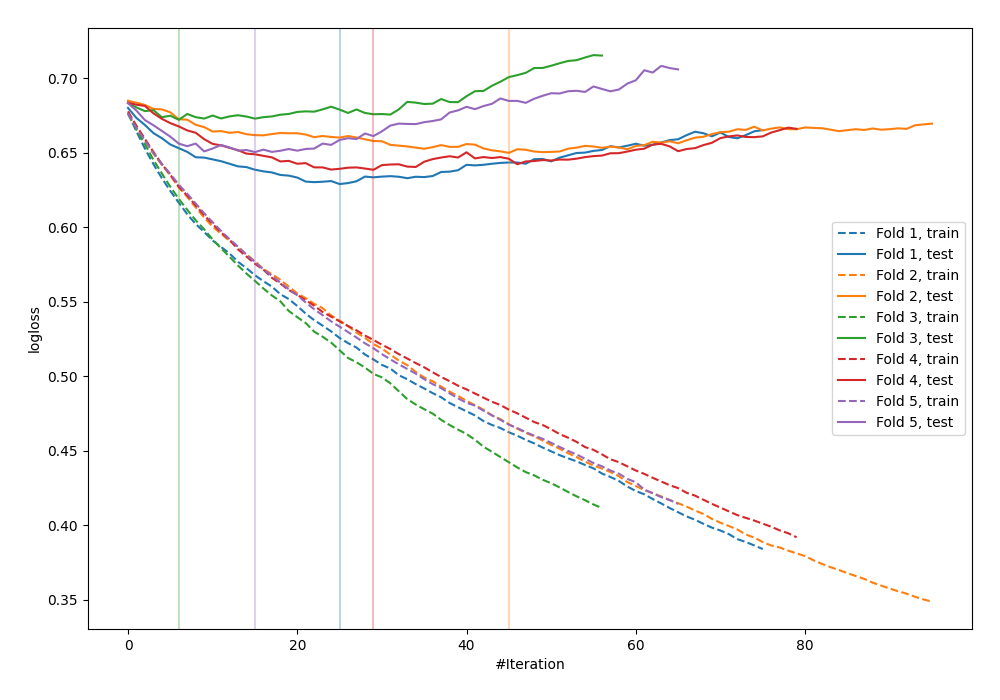

# Summary of 29_LightGBM

[<< Go back](../README.md)

## LightGBM
- **n_jobs**: -1
- **objective**: binary
- **metric**: binary_logloss
- **num_leaves**: 15
- **learning_rate**: 0.05
- **feature_fraction**: 1.0
- **bagging_fraction**: 0.5
- **min_data_in_leaf**: 30
- **explain_level**: 0

## Validation
 - **validation_type**: kfold
 - **shuffle**: True
 - **stratify**: True
 - **k_folds**: 5

## Optimized metric
logloss

## Training time

1.1 seconds

## Metric details
|           |    score |   threshold |
|:----------|---------:|------------:|
| logloss   | 0.647985 |  nan        |
| auc       | 0.6564   |  nan        |
| f1        | 0.661247 |    0.364776 |
| accuracy  | 0.623003 |    0.455557 |
| precision | 0.75     |    0.688542 |
| recall    | 1        |    0.086295 |
| mcc       | 0.283813 |    0.364776 |

## Confusion matrix (at threshold=0.455557)
|                     |   Predicted as negative |   Predicted as positive |
|:--------------------|------------------------:|------------------------:|
| Labeled as negative |                     114 |                      59 |
| Labeled as positive |                      59 |                      81 |

## Learning curves

[<< Go back](../README.md)
