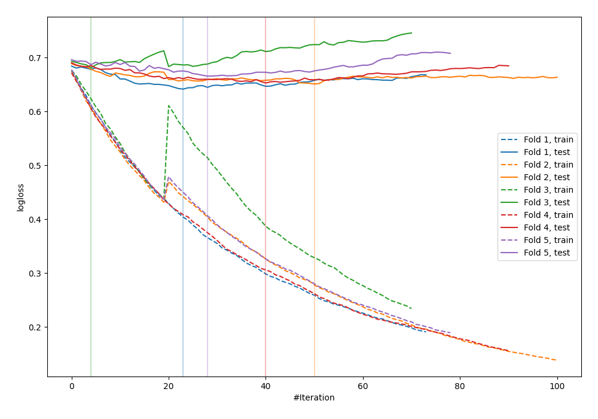

# Summary of 30_CatBoost

[<< Go back](../README.md)

## CatBoost
- **n_jobs**: -1
- **learning_rate**: 0.05
- **depth**: 8
- **rsm**: 0.8
- **loss_function**: Logloss
- **explain_level**: 0

## Validation
 - **validation_type**: kfold
 - **shuffle**: True
 - **stratify**: True
 - **k_folds**: 5

## Optimized metric
logloss

## Training time

4.5 seconds

## Metric details
|           |    score |   threshold |
|:----------|---------:|------------:|
| logloss   | 0.659066 |  nan        |
| auc       | 0.62564  |  nan        |
| f1        | 0.641509 |    0.314703 |
| accuracy  | 0.610224 |    0.483766 |
| precision | 1        |    0.738298 |
| recall    | 1        |    0.128257 |
| mcc       | 0.210627 |    0.483766 |

## Confusion matrix (at threshold=0.483766)
|                     |   Predicted as negative |   Predicted as positive |
|:--------------------|------------------------:|------------------------:|
| Labeled as negative |                     113 |                      60 |
| Labeled as positive |                      62 |                      78 |

## Learning curves

[<< Go back](../README.md)
