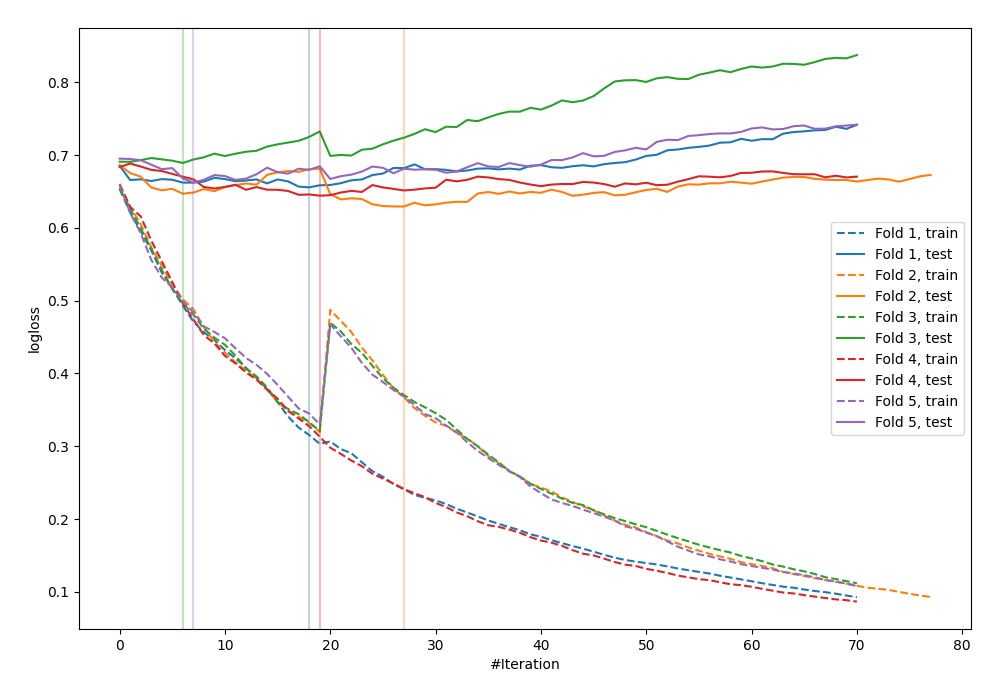

# Summary of 31_CatBoost

[<< Go back](../README.md)

## CatBoost
- **n_jobs**: -1
- **learning_rate**: 0.1
- **depth**: 8
- **rsm**: 1.0
- **loss_function**: Logloss
- **explain_level**: 0

## Validation
 - **validation_type**: kfold
 - **shuffle**: True
 - **stratify**: True
 - **k_folds**: 5

## Optimized metric
logloss

## Training time

4.8 seconds

## Metric details
|           |    score |   threshold |
|:----------|---------:|------------:|
| logloss   | 0.659949 |  nan        |
| auc       | 0.633774 |  nan        |
| f1        | 0.651163 |    0.366091 |
| accuracy  | 0.613419 |    0.589081 |
| precision | 0.688889 |    0.606372 |
| recall    | 1        |    0.179209 |
| mcc       | 0.244484 |    0.366091 |

## Confusion matrix (at threshold=0.589081)
|                     |   Predicted as negative |   Predicted as positive |
|:--------------------|------------------------:|------------------------:|
| Labeled as negative |                     154 |                      19 |
| Labeled as positive |                     102 |                      38 |

## Learning curves

[<< Go back](../README.md)
