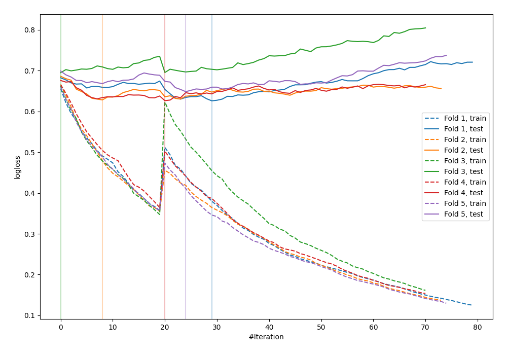

# Summary of 32_CatBoost

[<< Go back](../README.md)

## CatBoost
- **n_jobs**: -1
- **learning_rate**: 0.1
- **depth**: 7
- **rsm**: 1.0
- **loss_function**: Logloss
- **explain_level**: 0

## Validation
 - **validation_type**: kfold
 - **shuffle**: True
 - **stratify**: True
 - **k_folds**: 5

## Optimized metric
logloss

## Training time

3.3 seconds

## Metric details
|           |    score |   threshold |
|:----------|---------:|------------:|
| logloss   | 0.645449 |  nan        |
| auc       | 0.665834 |  nan        |
| f1        | 0.643979 |    0.384334 |
| accuracy  | 0.632588 |    0.535555 |
| precision | 0.833333 |    0.695326 |
| recall    | 1        |    0.157994 |
| mcc       | 0.258576 |    0.476573 |

## Confusion matrix (at threshold=0.535555)
|                     |   Predicted as negative |   Predicted as positive |
|:--------------------|------------------------:|------------------------:|
| Labeled as negative |                     140 |                      33 |
| Labeled as positive |                      82 |                      58 |

## Learning curves

[<< Go back](../README.md)
