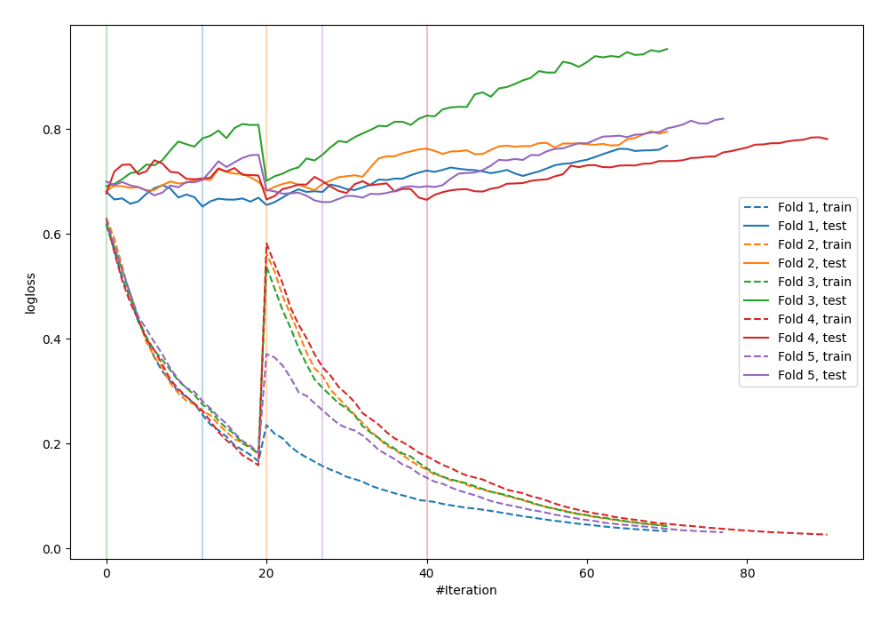

# Summary of 33_CatBoost

[<< Go back](../README.md)

## CatBoost
- **n_jobs**: -1
- **learning_rate**: 0.2
- **depth**: 8
- **rsm**: 1.0
- **loss_function**: Logloss
- **explain_level**: 0

## Validation
 - **validation_type**: kfold
 - **shuffle**: True
 - **stratify**: True
 - **k_folds**: 5

## Optimized metric
logloss

## Training time

4.9 seconds

## Metric details
|           |    score |   threshold |
|:----------|---------:|------------:|
| logloss   | 0.672918 |  nan        |
| auc       | 0.629377 |  nan        |
| f1        | 0.635945 |    0.214081 |
| accuracy  | 0.616613 |    0.469252 |
| precision | 0.61194  |    0.592557 |
| recall    | 1        |    0.111999 |
| mcc       | 0.236964 |    0.469252 |

## Confusion matrix (at threshold=0.469252)
|                     |   Predicted as negative |   Predicted as positive |
|:--------------------|------------------------:|------------------------:|
| Labeled as negative |                     103 |                      70 |
| Labeled as positive |                      50 |                      90 |

## Learning curves

[<< Go back](../README.md)
