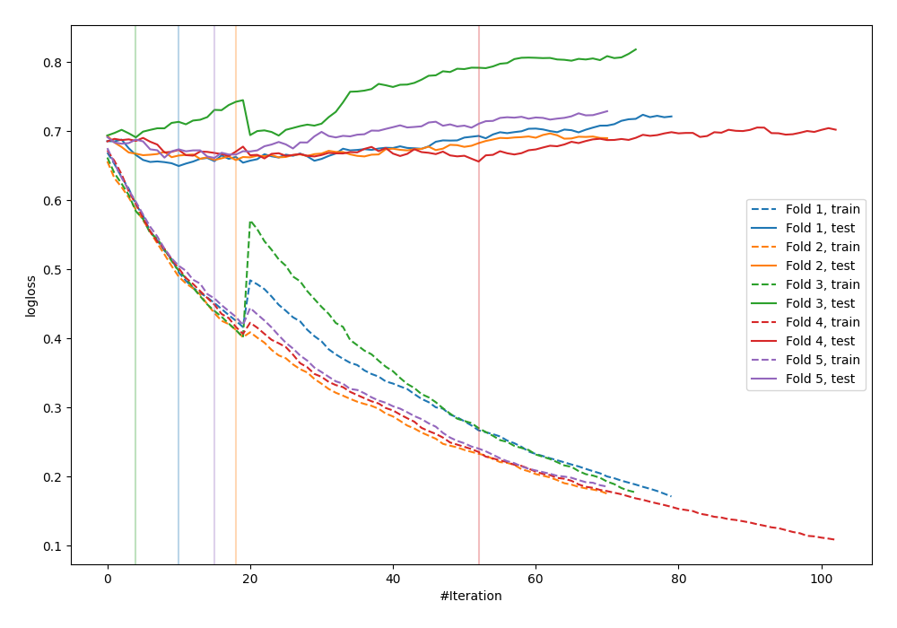

# Summary of 34_CatBoost

[<< Go back](../README.md)

## CatBoost
- **n_jobs**: -1
- **learning_rate**: 0.1
- **depth**: 6
- **rsm**: 0.7
- **loss_function**: Logloss
- **explain_level**: 0

## Validation
 - **validation_type**: kfold
 - **shuffle**: True
 - **stratify**: True
 - **k_folds**: 5

## Optimized metric
logloss

## Training time

2.1 seconds

## Metric details
|           |    score |   threshold |
|:----------|---------:|------------:|
| logloss   | 0.667687 | nan         |
| auc       | 0.616268 | nan         |
| f1        | 0.638298 |   0.25739   |
| accuracy  | 0.594249 |   0.496172  |
| precision | 0.633333 |   0.658401  |
| recall    | 1        |   0.0463673 |
| mcc       | 0.217766 |   0.346399  |

## Confusion matrix (at threshold=0.496172)
|                     |   Predicted as negative |   Predicted as positive |
|:--------------------|------------------------:|------------------------:|
| Labeled as negative |                     119 |                      54 |
| Labeled as positive |                      73 |                      67 |

## Learning curves

[<< Go back](../README.md)
