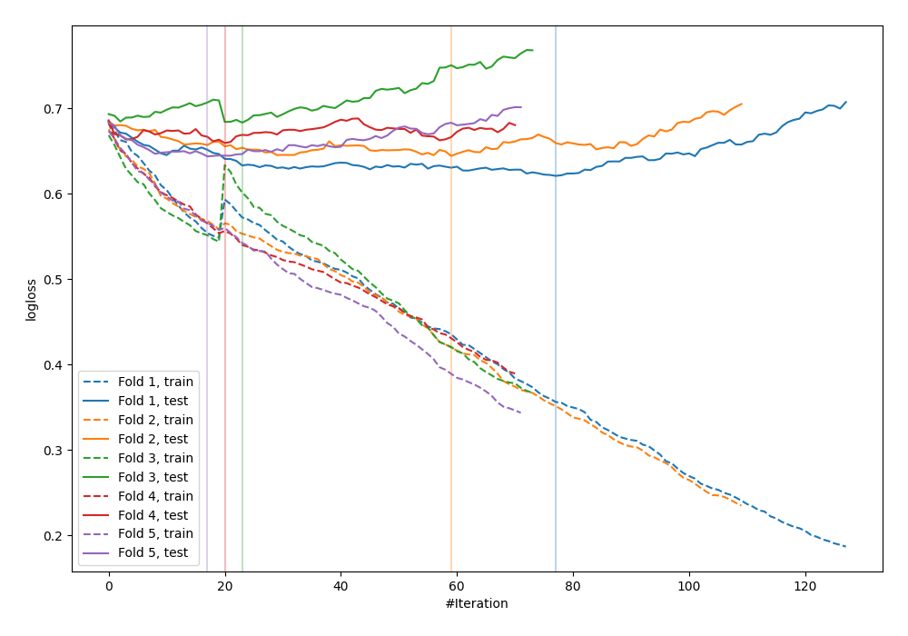

# Summary of 35_CatBoost_GoldenFeatures

[<< Go back](../README.md)

## CatBoost
- **n_jobs**: -1
- **learning_rate**: 0.1
- **depth**: 4
- **rsm**: 0.7
- **loss_function**: Logloss
- **explain_level**: 0

## Validation
 - **validation_type**: kfold
 - **shuffle**: True
 - **stratify**: True
 - **k_folds**: 5

## Optimized metric
logloss

## Training time

2.0 seconds

## Metric details
|           |    score |   threshold |
|:----------|---------:|------------:|
| logloss   | 0.650375 | nan         |
| auc       | 0.651424 | nan         |
| f1        | 0.650124 |   0.312528  |
| accuracy  | 0.626198 |   0.497758  |
| precision | 1        |   0.790541  |
| recall    | 1        |   0.0956824 |
| mcc       | 0.238898 |   0.497758  |

## Confusion matrix (at threshold=0.497758)
|                     |   Predicted as negative |   Predicted as positive |
|:--------------------|------------------------:|------------------------:|
| Labeled as negative |                     120 |                      53 |
| Labeled as positive |                      64 |                      76 |

## Learning curves

[<< Go back](../README.md)
