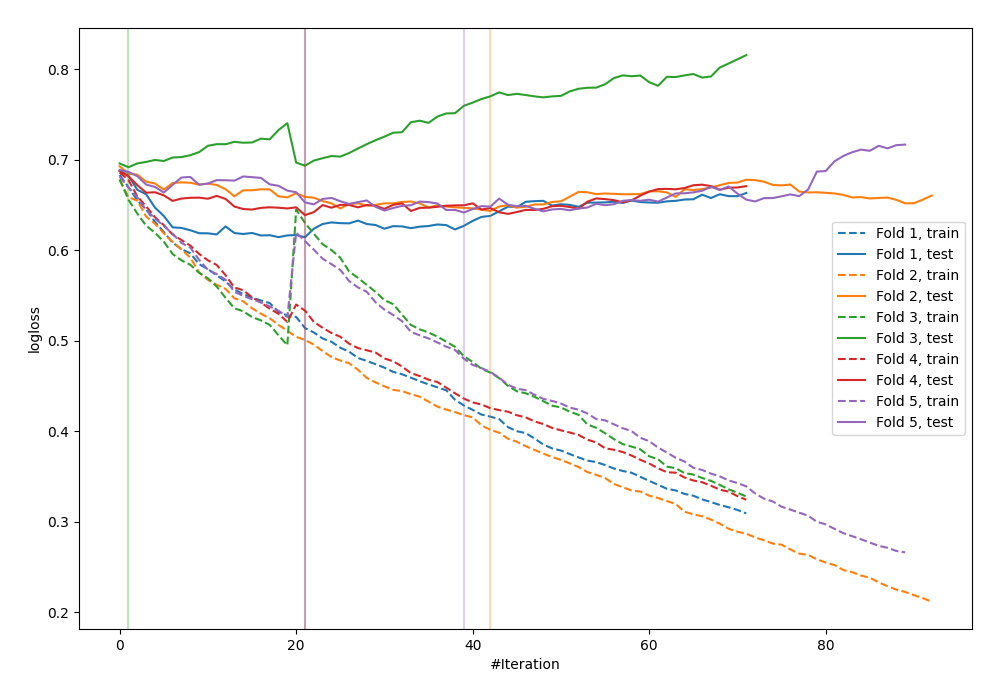

# Summary of 35_CatBoost_KMeansFeatures

[<< Go back](../README.md)

## CatBoost
- **n_jobs**: -1
- **learning_rate**: 0.1
- **depth**: 4
- **rsm**: 0.7
- **loss_function**: Logloss
- **explain_level**: 0

## Validation
 - **validation_type**: kfold
 - **shuffle**: True
 - **stratify**: True
 - **k_folds**: 5

## Optimized metric
logloss

## Training time

2.9 seconds

## Metric details
|           |    score |   threshold |
|:----------|---------:|------------:|
| logloss   | 0.646337 |  nan        |
| auc       | 0.653675 |  nan        |
| f1        | 0.653753 |    0.30664  |
| accuracy  | 0.658147 |    0.549469 |
| precision | 0.78125  |    0.608163 |
| recall    | 1        |    0.122245 |
| mcc       | 0.312134 |    0.549469 |

## Confusion matrix (at threshold=0.549469)
|                     |   Predicted as negative |   Predicted as positive |
|:--------------------|------------------------:|------------------------:|
| Labeled as negative |                     155 |                      18 |
| Labeled as positive |                      89 |                      51 |

## Learning curves

[<< Go back](../README.md)
