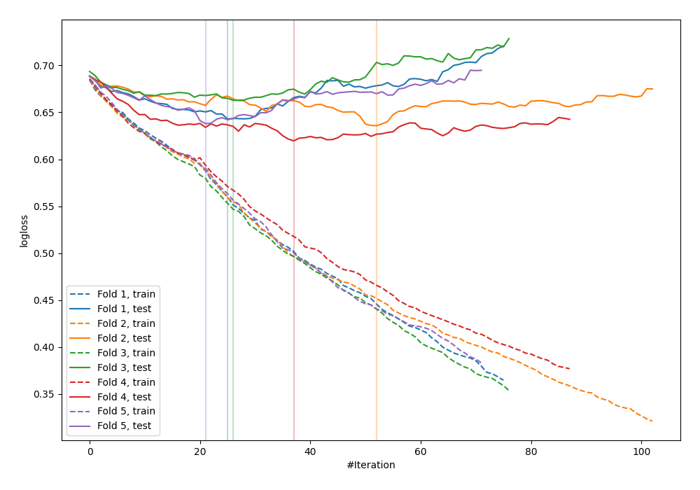

# Summary of 35_CatBoost_SelectedFeatures

[<< Go back](../README.md)

## CatBoost
- **n_jobs**: -1
- **learning_rate**: 0.1
- **depth**: 4
- **rsm**: 0.7
- **loss_function**: Logloss
- **explain_level**: 0

## Validation
 - **validation_type**: kfold
 - **shuffle**: True
 - **stratify**: True
 - **k_folds**: 5

## Optimized metric
logloss

## Training time

1.5 seconds

## Metric details
|           |    score |   threshold |
|:----------|---------:|------------:|
| logloss   | 0.639841 | nan         |
| auc       | 0.679604 | nan         |
| f1        | 0.650307 |   0.426833  |
| accuracy  | 0.664537 |   0.500776  |
| precision | 0.65     |   0.656548  |
| recall    | 1        |   0.0988375 |
| mcc       | 0.31861  |   0.500776  |

## Confusion matrix (at threshold=0.500776)
|                     |   Predicted as negative |   Predicted as positive |
|:--------------------|------------------------:|------------------------:|
| Labeled as negative |                     124 |                      49 |
| Labeled as positive |                      56 |                      84 |

## Learning curves

[<< Go back](../README.md)
