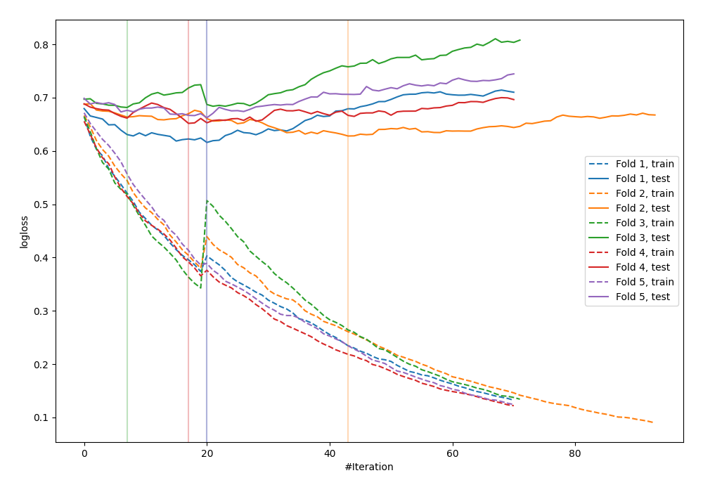

# Summary of 37_CatBoost

[<< Go back](../README.md)

## CatBoost
- **n_jobs**: -1
- **learning_rate**: 0.1
- **depth**: 7
- **rsm**: 0.8
- **loss_function**: Logloss
- **explain_level**: 0

## Validation
 - **validation_type**: kfold
 - **shuffle**: True
 - **stratify**: True
 - **k_folds**: 5

## Optimized metric
logloss

## Training time

3.4 seconds

## Metric details
|           |    score |   threshold |
|:----------|---------:|------------:|
| logloss   | 0.648463 | nan         |
| auc       | 0.655202 | nan         |
| f1        | 0.653465 |   0.296188  |
| accuracy  | 0.613419 |   0.430762  |
| precision | 0.75     |   0.657547  |
| recall    | 1        |   0.0743489 |
| mcc       | 0.248077 |   0.398616  |

## Confusion matrix (at threshold=0.430762)
|                     |   Predicted as negative |   Predicted as positive |
|:--------------------|------------------------:|------------------------:|
| Labeled as negative |                      96 |                      77 |
| Labeled as positive |                      44 |                      96 |

## Learning curves

[<< Go back](../README.md)
