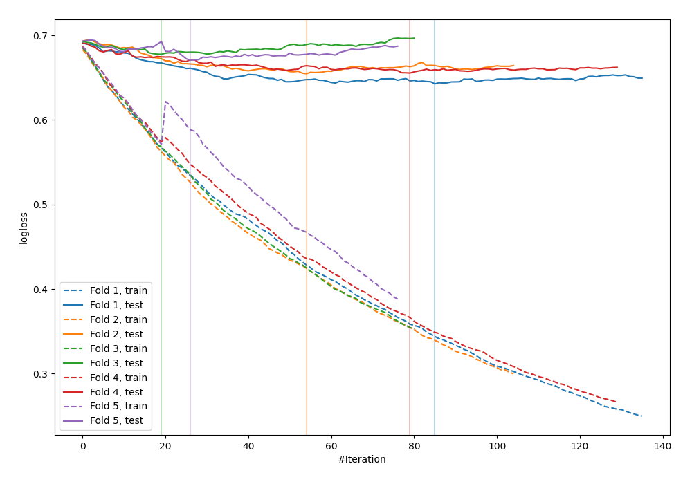

# Summary of 38_CatBoost

[<< Go back](../README.md)

## CatBoost
- **n_jobs**: -1
- **learning_rate**: 0.025
- **depth**: 7
- **rsm**: 0.7
- **loss_function**: Logloss
- **explain_level**: 0

## Validation
 - **validation_type**: kfold
 - **shuffle**: True
 - **stratify**: True
 - **k_folds**: 5

## Optimized metric
logloss

## Training time

4.2 seconds

## Metric details
|           |    score |   threshold |
|:----------|---------:|------------:|
| logloss   | 0.660248 |  nan        |
| auc       | 0.622709 |  nan        |
| f1        | 0.64042  |    0.399031 |
| accuracy  | 0.607029 |    0.502229 |
| precision | 0.833333 |    0.710784 |
| recall    | 1        |    0.138196 |
| mcc       | 0.216874 |    0.399031 |

## Confusion matrix (at threshold=0.502229)
|                     |   Predicted as negative |   Predicted as positive |
|:--------------------|------------------------:|------------------------:|
| Labeled as negative |                     124 |                      49 |
| Labeled as positive |                      74 |                      66 |

## Learning curves

[<< Go back](../README.md)
