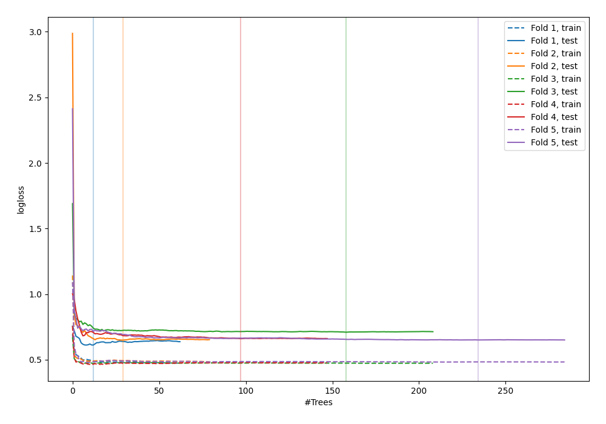

# Summary of 39_RandomForest

[<< Go back](../README.md)

## Random Forest
- **n_jobs**: -1
- **criterion**: gini
- **max_features**: 0.5
- **min_samples_split**: 20
- **max_depth**: 4
- **explain_level**: 0

## Validation
 - **validation_type**: kfold
 - **shuffle**: True
 - **stratify**: True
 - **k_folds**: 5

## Optimized metric
logloss

## Training time

7.0 seconds

## Metric details
|           |    score |   threshold |
|:----------|---------:|------------:|
| logloss   | 0.656143 | nan         |
| auc       | 0.632494 | nan         |
| f1        | 0.658477 |   0.281667  |
| accuracy  | 0.594249 |   0.550969  |
| precision | 0.888889 |   0.710352  |
| recall    | 1        |   0.0627872 |
| mcc       | 0.264505 |   0.281667  |

## Confusion matrix (at threshold=0.550969)
|                     |   Predicted as negative |   Predicted as positive |
|:--------------------|------------------------:|------------------------:|
| Labeled as negative |                     134 |                      39 |
| Labeled as positive |                      88 |                      52 |

## Learning curves

[<< Go back](../README.md)
