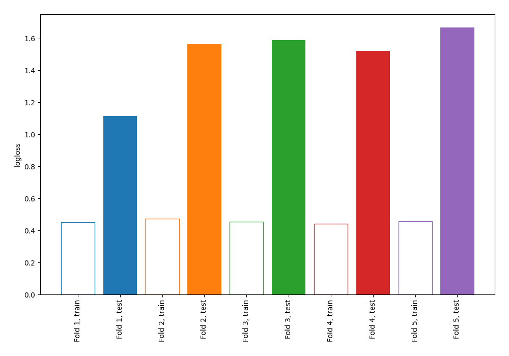

# Summary of 3_DecisionTree

[<< Go back](../README.md)

## Decision Tree
- **n_jobs**: -1
- **criterion**: gini
- **max_depth**: 4
- **explain_level**: 0

## Validation
 - **validation_type**: kfold
 - **shuffle**: True
 - **stratify**: True
 - **k_folds**: 5

## Optimized metric
logloss

## Training time

0.7 seconds

## Metric details
|           |    score |   threshold |
|:----------|---------:|------------:|
| logloss   | 1.49058  | nan         |
| auc       | 0.578737 | nan         |
| f1        | 0.653165 |   0.0381423 |
| accuracy  | 0.571885 |   0.219101  |
| precision | 0.512821 |   0.219101  |
| recall    | 0.942857 |   0         |
| mcc       | 0.247113 |   0.0381423 |

## Confusion matrix (at threshold=0.219101)
|                     |   Predicted as negative |   Predicted as positive |
|:--------------------|------------------------:|------------------------:|
| Labeled as negative |                      59 |                     114 |
| Labeled as positive |                      20 |                     120 |

## Learning curves

[<< Go back](../README.md)
