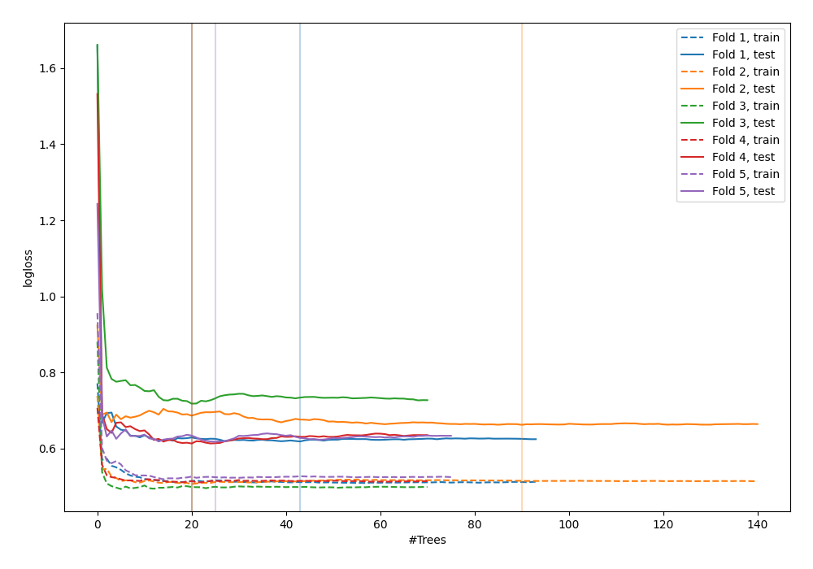

# Summary of 42_RandomForest_GoldenFeatures

[<< Go back](../README.md)

## Random Forest
- **n_jobs**: -1
- **criterion**: entropy
- **max_features**: 0.6
- **min_samples_split**: 50
- **max_depth**: 6
- **explain_level**: 0

## Validation
 - **validation_type**: kfold
 - **shuffle**: True
 - **stratify**: True
 - **k_folds**: 5

## Optimized metric
logloss

## Training time

7.6 seconds

## Metric details
|           |    score |   threshold |
|:----------|---------:|------------:|
| logloss   | 0.645942 |  nan        |
| auc       | 0.656379 |  nan        |
| f1        | 0.659847 |    0.260654 |
| accuracy  | 0.623003 |    0.503877 |
| precision | 0.857143 |    0.69254  |
| recall    | 1        |    0.109814 |
| mcc       | 0.269751 |    0.260654 |

## Confusion matrix (at threshold=0.503877)
|                     |   Predicted as negative |   Predicted as positive |
|:--------------------|------------------------:|------------------------:|
| Labeled as negative |                     117 |                      56 |
| Labeled as positive |                      62 |                      78 |

## Learning curves

[<< Go back](../README.md)
