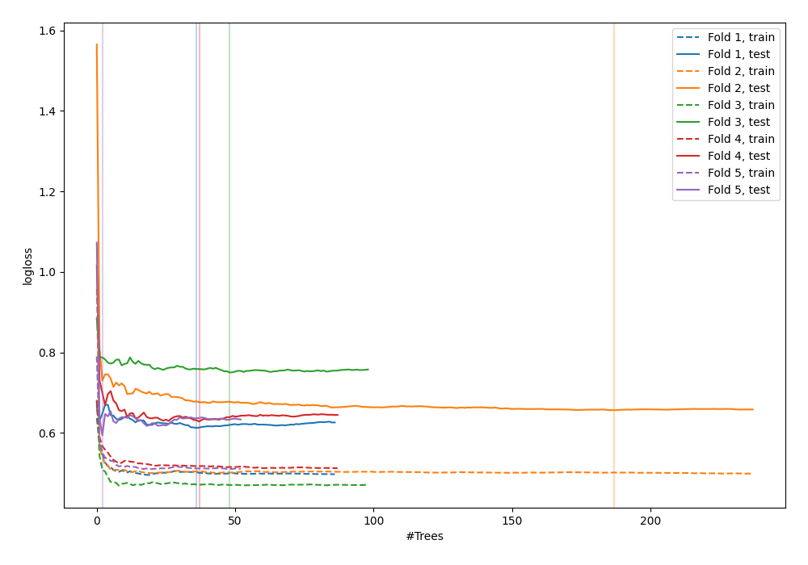

# Summary of 42_RandomForest_KMeansFeatures

[<< Go back](../README.md)

## Random Forest
- **n_jobs**: -1
- **criterion**: entropy
- **max_features**: 0.6
- **min_samples_split**: 50
- **max_depth**: 6
- **explain_level**: 0

## Validation
 - **validation_type**: kfold
 - **shuffle**: True
 - **stratify**: True
 - **k_folds**: 5

## Optimized metric
logloss

## Training time

8.2 seconds

## Metric details
|           |    score |   threshold |
|:----------|---------:|------------:|
| logloss   | 0.648354 | nan         |
| auc       | 0.656957 | nan         |
| f1        | 0.664908 |   0.276754  |
| accuracy  | 0.645367 |   0.45454   |
| precision | 0.636364 |   0.707362  |
| recall    | 1        |   0.0753231 |
| mcc       | 0.298563 |   0.453216  |

## Confusion matrix (at threshold=0.45454)
|                     |   Predicted as negative |   Predicted as positive |
|:--------------------|------------------------:|------------------------:|
| Labeled as negative |                     106 |                      67 |
| Labeled as positive |                      44 |                      96 |

## Learning curves

[<< Go back](../README.md)
