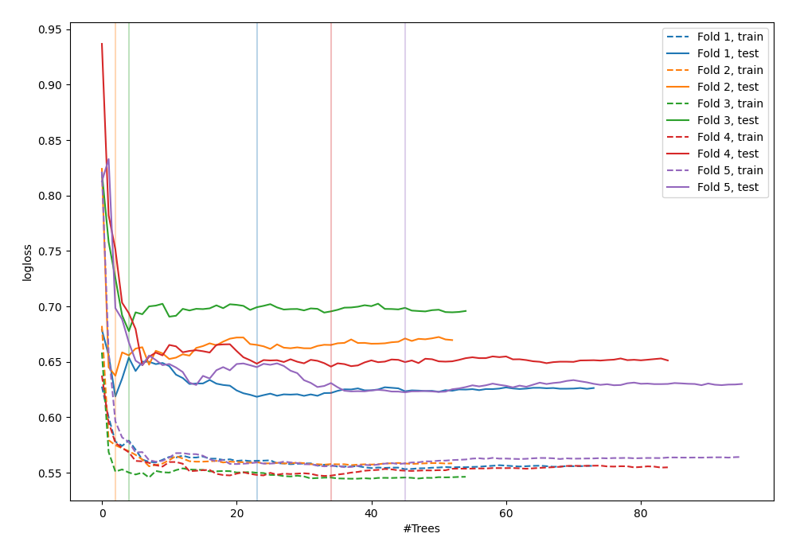

# Summary of 43_RandomForest

[<< Go back](../README.md)

## Random Forest
- **n_jobs**: -1
- **criterion**: gini
- **max_features**: 0.7
- **min_samples_split**: 50
- **max_depth**: 3
- **explain_level**: 0

## Validation
 - **validation_type**: kfold
 - **shuffle**: True
 - **stratify**: True
 - **k_folds**: 5

## Optimized metric
logloss

## Training time

3.5 seconds

## Metric details
|           |    score |   threshold |
|:----------|---------:|------------:|
| logloss   | 0.640449 |  nan        |
| auc       | 0.666763 |  nan        |
| f1        | 0.666667 |    0.318184 |
| accuracy  | 0.629393 |    0.451598 |
| precision | 0.909091 |    0.670567 |
| recall    | 1        |    0.11381  |
| mcc       | 0.29174  |    0.318184 |

## Confusion matrix (at threshold=0.451598)
|                     |   Predicted as negative |   Predicted as positive |
|:--------------------|------------------------:|------------------------:|
| Labeled as negative |                      98 |                      75 |
| Labeled as positive |                      41 |                      99 |

## Learning curves

[<< Go back](../README.md)
