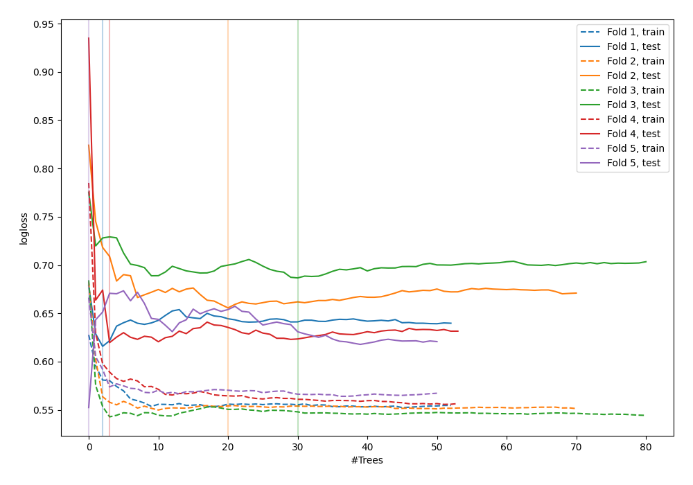

# Summary of 43_RandomForest_GoldenFeatures

[<< Go back](../README.md)

## Random Forest
- **n_jobs**: -1
- **criterion**: gini
- **max_features**: 0.7
- **min_samples_split**: 50
- **max_depth**: 3
- **explain_level**: 0

## Validation
 - **validation_type**: kfold
 - **shuffle**: True
 - **stratify**: True
 - **k_folds**: 5

## Optimized metric
logloss

## Training time

3.8 seconds

## Metric details
|           |    score |   threshold |
|:----------|---------:|------------:|
| logloss   | 0.626333 |  nan        |
| auc       | 0.69711  |  nan        |
| f1        | 0.670241 |    0.315815 |
| accuracy  | 0.648562 |    0.501157 |
| precision | 0.782609 |    0.685597 |
| recall    | 1        |    0.103846 |
| mcc       | 0.306152 |    0.315815 |

## Confusion matrix (at threshold=0.501157)
|                     |   Predicted as negative |   Predicted as positive |
|:--------------------|------------------------:|------------------------:|
| Labeled as negative |                     110 |                      63 |
| Labeled as positive |                      47 |                      93 |

## Learning curves

[<< Go back](../README.md)
