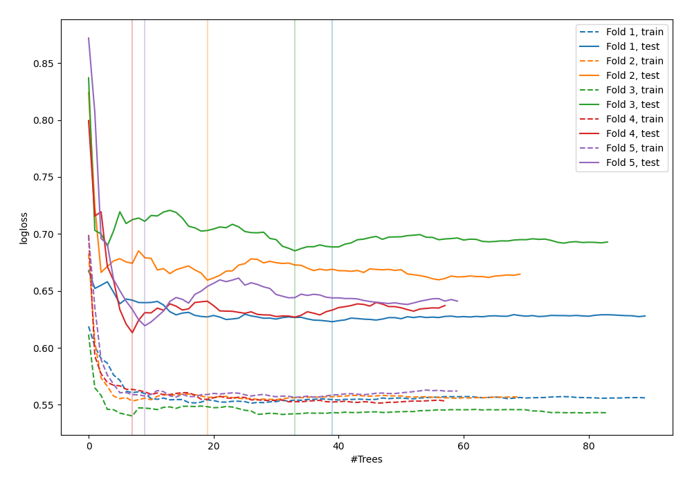
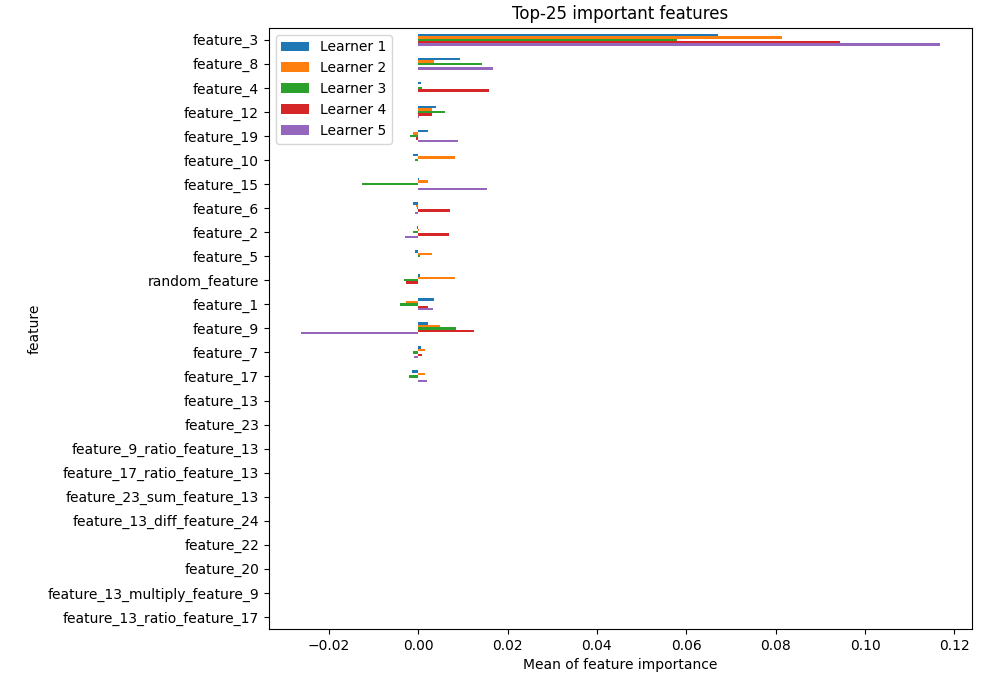

# Summary of 43_RandomForest_GoldenFeatures_RandomFeature

[<< Go back](../README.md)

## Random Forest
- **n_jobs**: -1
- **criterion**: gini
- **max_features**: 0.7
- **min_samples_split**: 50
- **max_depth**: 3
- **explain_level**: 1

## Validation
 - **validation_type**: kfold
 - **shuffle**: True
 - **stratify**: True
 - **k_folds**: 5

## Optimized metric
logloss

## Training time

29.4 seconds

## Metric details
|           |    score |   threshold |
|:----------|---------:|------------:|
| logloss   | 0.640199 |  nan        |
| auc       | 0.670871 |  nan        |
| f1        | 0.657963 |    0.322804 |
| accuracy  | 0.645367 |    0.552417 |
| precision | 1        |    0.687982 |
| recall    | 1        |    0.121564 |
| mcc       | 0.281166 |    0.448852 |

## Confusion matrix (at threshold=0.552417)
|                     |   Predicted as negative |   Predicted as positive |
|:--------------------|------------------------:|------------------------:|
| Labeled as negative |                     138 |                      35 |
| Labeled as positive |                      76 |                      64 |

## Learning curves

## Permutation-based Importance

[<< Go back](../README.md)
