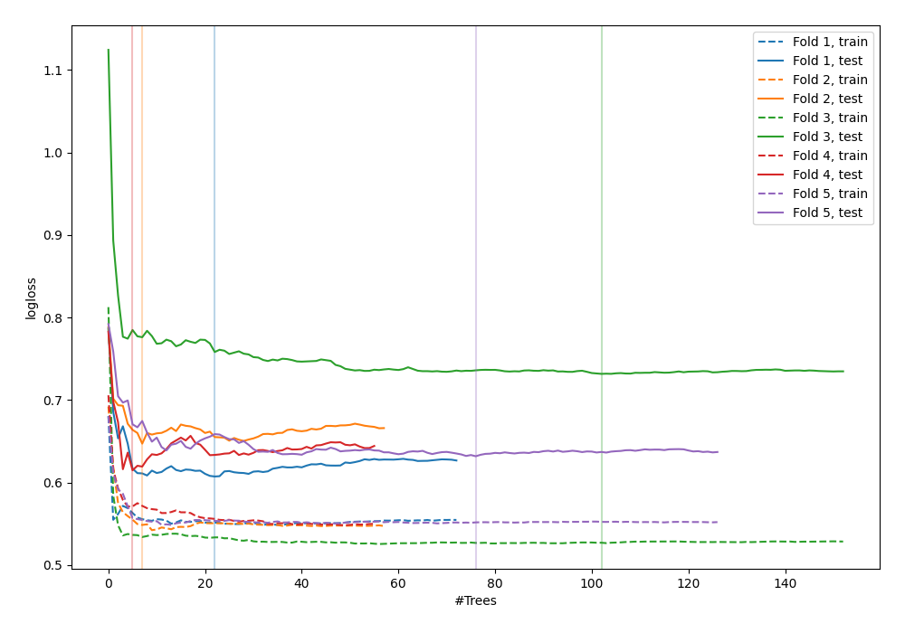

# Summary of 43_RandomForest_KMeansFeatures

[<< Go back](../README.md)

## Random Forest
- **n_jobs**: -1
- **criterion**: gini
- **max_features**: 0.7
- **min_samples_split**: 50
- **max_depth**: 3
- **explain_level**: 0

## Validation
 - **validation_type**: kfold
 - **shuffle**: True
 - **stratify**: True
 - **k_folds**: 5

## Optimized metric
logloss

## Training time

7.0 seconds

## Metric details
|           |    score |   threshold |
|:----------|---------:|------------:|
| logloss   | 0.646849 | nan         |
| auc       | 0.661726 | nan         |
| f1        | 0.64433  |   0.312615  |
| accuracy  | 0.626198 |   0.429881  |
| precision | 1        |   0.740654  |
| recall    | 1        |   0.0964716 |
| mcc       | 0.270025 |   0.429881  |

## Confusion matrix (at threshold=0.429881)
|                     |   Predicted as negative |   Predicted as positive |
|:--------------------|------------------------:|------------------------:|
| Labeled as negative |                      96 |                      77 |
| Labeled as positive |                      40 |                     100 |

## Learning curves

[<< Go back](../README.md)
