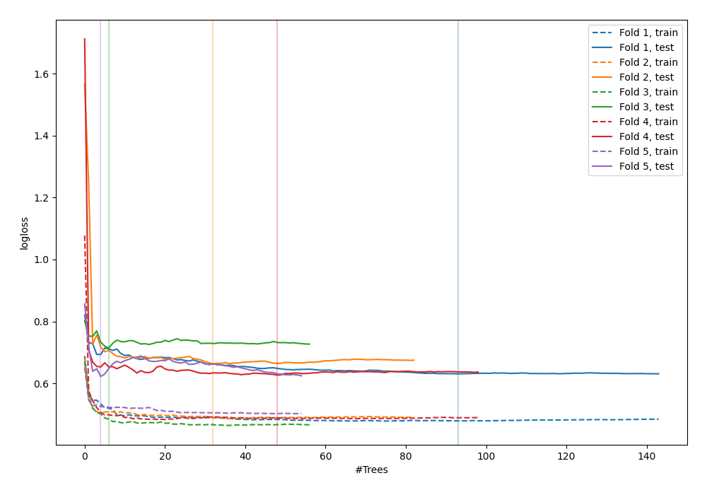

# Summary of 45_RandomForest

[<< Go back](../README.md)

## Random Forest
- **n_jobs**: -1
- **criterion**: gini
- **max_features**: 0.9
- **min_samples_split**: 40
- **max_depth**: 5
- **explain_level**: 0

## Validation
 - **validation_type**: kfold
 - **shuffle**: True
 - **stratify**: True
 - **k_folds**: 5

## Optimized metric
logloss

## Training time

8.0 seconds

## Metric details
|           |    score |   threshold |
|:----------|---------:|------------:|
| logloss   | 0.651364 | nan         |
| auc       | 0.648988 | nan         |
| f1        | 0.659847 |   0.280737  |
| accuracy  | 0.629393 |   0.516136  |
| precision | 0.866667 |   0.711252  |
| recall    | 1        |   0.0569977 |
| mcc       | 0.269751 |   0.280737  |

## Confusion matrix (at threshold=0.516136)
|                     |   Predicted as negative |   Predicted as positive |
|:--------------------|------------------------:|------------------------:|
| Labeled as negative |                     117 |                      56 |
| Labeled as positive |                      60 |                      80 |

## Learning curves

[<< Go back](../README.md)
