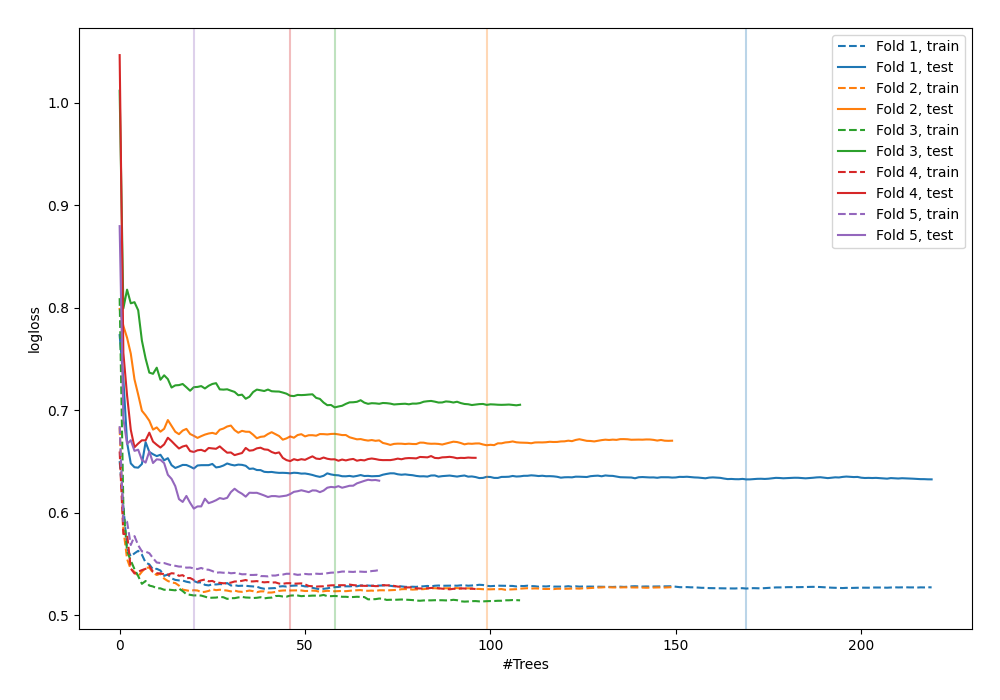

# Summary of 47_RandomForest

[<< Go back](../README.md)

## Random Forest
- **n_jobs**: -1
- **criterion**: gini
- **max_features**: 0.5
- **min_samples_split**: 50
- **max_depth**: 5
- **explain_level**: 0

## Validation
 - **validation_type**: kfold
 - **shuffle**: True
 - **stratify**: True
 - **k_folds**: 5

## Optimized metric
logloss

## Training time

7.3 seconds

## Metric details
|           |    score |   threshold |
|:----------|---------:|------------:|
| logloss   | 0.651242 |  nan        |
| auc       | 0.646243 |  nan        |
| f1        | 0.647815 |    0.291049 |
| accuracy  | 0.629393 |    0.474105 |
| precision | 1        |    0.703802 |
| recall    | 1        |    0.125353 |
| mcc       | 0.261265 |    0.474105 |

## Confusion matrix (at threshold=0.474105)
|                     |   Predicted as negative |   Predicted as positive |
|:--------------------|------------------------:|------------------------:|
| Labeled as negative |                     106 |                      67 |
| Labeled as positive |                      49 |                      91 |

## Learning curves

[<< Go back](../README.md)
