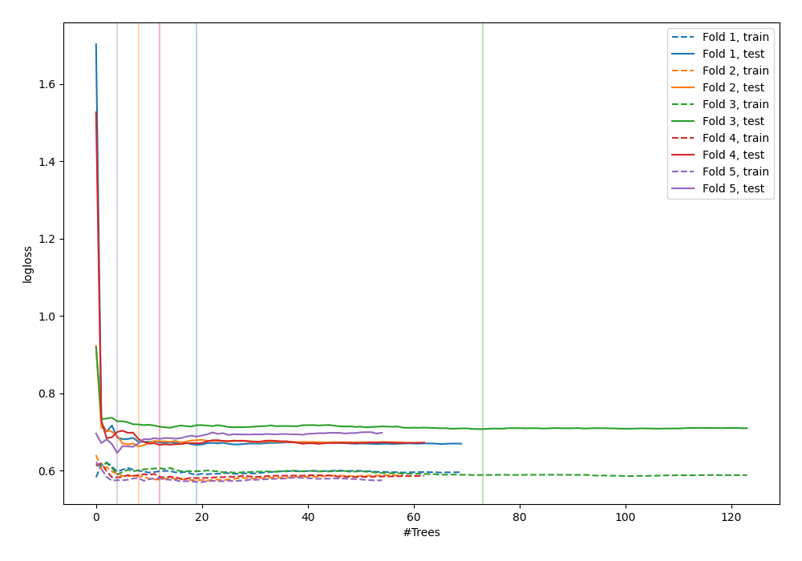

# Summary of 48_ExtraTrees

[<< Go back](../README.md)

## Extra Trees Classifier (Extra Trees)
- **n_jobs**: -1
- **criterion**: gini
- **max_features**: 0.5
- **min_samples_split**: 20
- **max_depth**: 4
- **explain_level**: 0

## Validation
 - **validation_type**: kfold
 - **shuffle**: True
 - **stratify**: True
 - **k_folds**: 5

## Optimized metric
logloss

## Training time

3.4 seconds

## Metric details
|           |    score |   threshold |
|:----------|---------:|------------:|
| logloss   | 0.669831 | nan         |
| auc       | 0.599154 | nan         |
| f1        | 0.627551 |   0.370016  |
| accuracy  | 0.584665 |   0.489401  |
| precision | 0.875    |   0.599618  |
| recall    | 1        |   0.0886274 |
| mcc       | 0.208583 |   0.410243  |

## Confusion matrix (at threshold=0.489401)
|                     |   Predicted as negative |   Predicted as positive |
|:--------------------|------------------------:|------------------------:|
| Labeled as negative |                     121 |                      52 |
| Labeled as positive |                      78 |                      62 |

## Learning curves

[<< Go back](../README.md)
