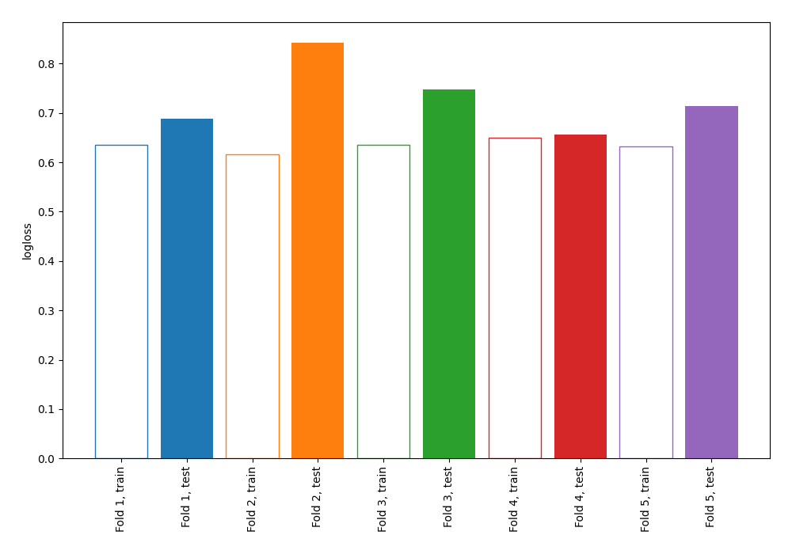

# Summary of 4_Linear

[<< Go back](../README.md)

## Logistic Regression (Linear)
- **n_jobs**: -1
- **explain_level**: 0

## Validation
 - **validation_type**: kfold
 - **shuffle**: True
 - **stratify**: True
 - **k_folds**: 5

## Optimized metric
logloss

## Training time

3.0 seconds

## Metric details
|           |    score |   threshold |
|:----------|---------:|------------:|
| logloss   | 0.729924 | nan         |
| auc       | 0.594922 | nan         |
| f1        | 0.620225 |   0.154949  |
| accuracy  | 0.610224 |   0.488936  |
| precision | 0.576271 |   0.488936  |
| recall    | 1        |   0.0398618 |
| mcc       | 0.201802 |   0.488936  |

## Confusion matrix (at threshold=0.488936)
|                     |   Predicted as negative |   Predicted as positive |
|:--------------------|------------------------:|------------------------:|
| Labeled as negative |                     123 |                      50 |
| Labeled as positive |                      72 |                      68 |

## Learning curves

[<< Go back](../README.md)
