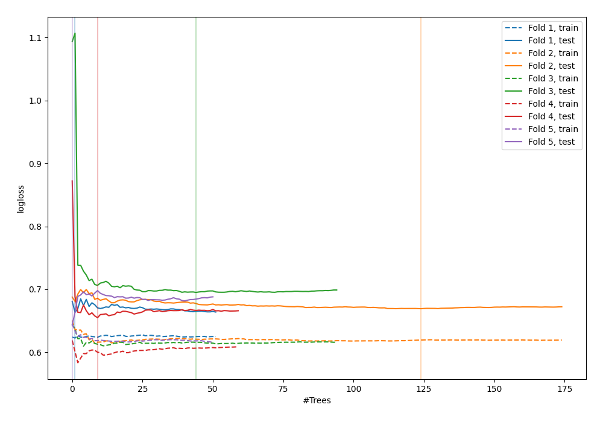

# Summary of 50_ExtraTrees

[<< Go back](../README.md)

## Extra Trees Classifier (Extra Trees)
- **n_jobs**: -1
- **criterion**: gini
- **max_features**: 0.8
- **min_samples_split**: 40
- **max_depth**: 3
- **explain_level**: 0

## Validation
 - **validation_type**: kfold
 - **shuffle**: True
 - **stratify**: True
 - **k_folds**: 5

## Optimized metric
logloss

## Training time

3.8 seconds

## Metric details
|           |    score |   threshold |
|:----------|---------:|------------:|
| logloss   | 0.665443 | nan         |
| auc       | 0.608237 | nan         |
| f1        | 0.637755 |   0.339765  |
| accuracy  | 0.594249 |   0.519915  |
| precision | 0.676471 |   0.537303  |
| recall    | 1        |   0.0692308 |
| mcc       | 0.205603 |   0.393161  |

## Confusion matrix (at threshold=0.519915)
|                     |   Predicted as negative |   Predicted as positive |
|:--------------------|------------------------:|------------------------:|
| Labeled as negative |                     140 |                      33 |
| Labeled as positive |                      94 |                      46 |

## Learning curves

[<< Go back](../README.md)
