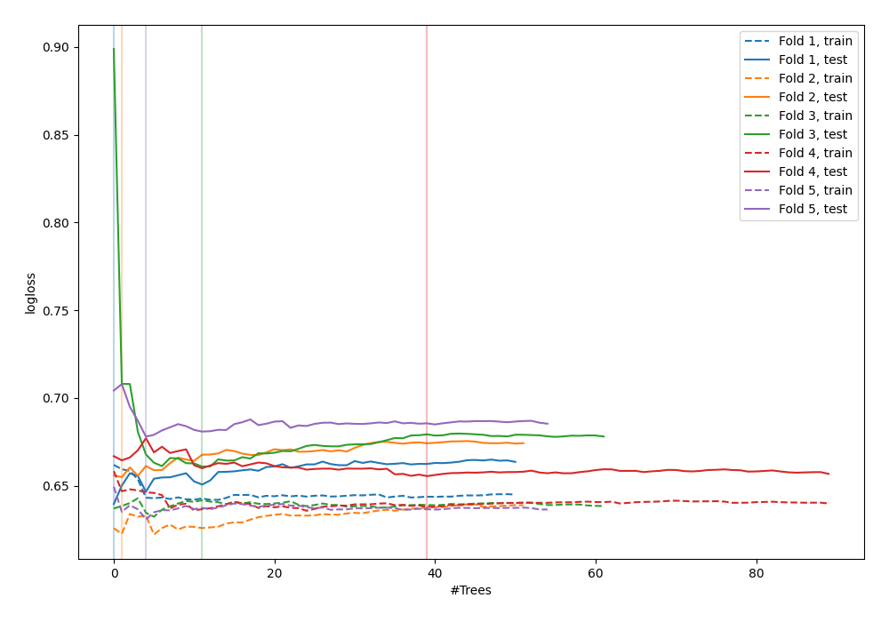

# Summary of 52_ExtraTrees_SelectedFeatures

[<< Go back](../README.md)

## Extra Trees Classifier (Extra Trees)
- **n_jobs**: -1
- **criterion**: gini
- **max_features**: 0.7
- **min_samples_split**: 50
- **max_depth**: 3
- **explain_level**: 0

## Validation
 - **validation_type**: kfold
 - **shuffle**: True
 - **stratify**: True
 - **k_folds**: 5

## Optimized metric
logloss

## Training time

3.5 seconds

## Metric details
|           |    score |   threshold |
|:----------|---------:|------------:|
| logloss   | 0.657703 | nan         |
| auc       | 0.644529 | nan         |
| f1        | 0.63789  |   0.341431  |
| accuracy  | 0.616613 |   0.507962  |
| precision | 0.685714 |   0.523804  |
| recall    | 1        |   0.0765957 |
| mcc       | 0.225177 |   0.419179  |

## Confusion matrix (at threshold=0.507962)
|                     |   Predicted as negative |   Predicted as positive |
|:--------------------|------------------------:|------------------------:|
| Labeled as negative |                     140 |                      33 |
| Labeled as positive |                      87 |                      53 |

## Learning curves

[<< Go back](../README.md)
