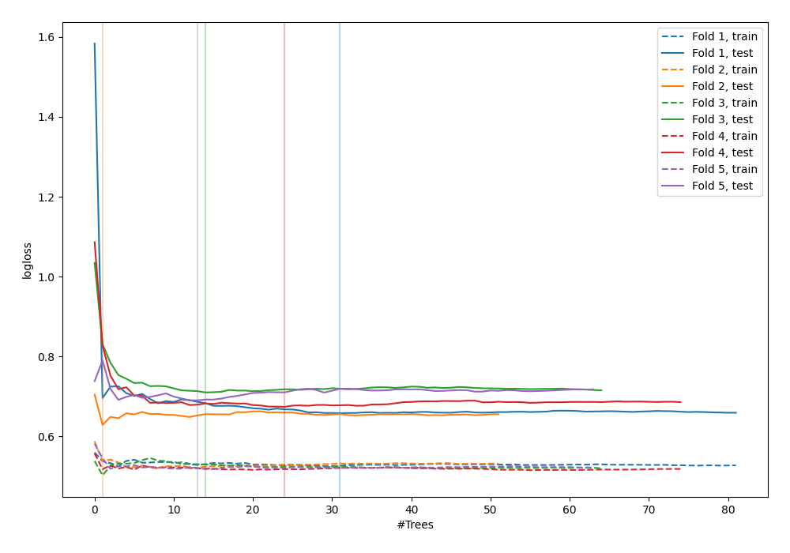

# Summary of 53_ExtraTrees

[<< Go back](../README.md)

## Extra Trees Classifier (Extra Trees)
- **n_jobs**: -1
- **criterion**: gini
- **max_features**: 1.0
- **min_samples_split**: 40
- **max_depth**: 7
- **explain_level**: 0

## Validation
 - **validation_type**: kfold
 - **shuffle**: True
 - **stratify**: True
 - **k_folds**: 5

## Optimized metric
logloss

## Training time

3.4 seconds

## Metric details
|           |    score |   threshold |
|:----------|---------:|------------:|
| logloss   | 0.672208 |  nan        |
| auc       | 0.597337 |  nan        |
| f1        | 0.631579 |    0.2145   |
| accuracy  | 0.623003 |    0.555373 |
| precision | 0.733333 |    0.670451 |
| recall    | 1        |    0.160941 |
| mcc       | 0.232478 |    0.555373 |

## Confusion matrix (at threshold=0.555373)
|                     |   Predicted as negative |   Predicted as positive |
|:--------------------|------------------------:|------------------------:|
| Labeled as negative |                     155 |                      18 |
| Labeled as positive |                     100 |                      40 |

## Learning curves

[<< Go back](../README.md)
