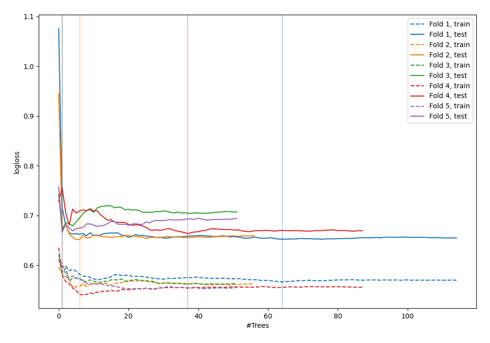

# Summary of 54_ExtraTrees

[<< Go back](../README.md)

## Extra Trees Classifier (Extra Trees)
- **n_jobs**: -1
- **criterion**: gini
- **max_features**: 0.9
- **min_samples_split**: 40
- **max_depth**: 5
- **explain_level**: 0

## Validation
 - **validation_type**: kfold
 - **shuffle**: True
 - **stratify**: True
 - **k_folds**: 5

## Optimized metric
logloss

## Training time

5.6 seconds

## Metric details
|           |    score |   threshold |
|:----------|---------:|------------:|
| logloss   | 0.660601 |  nan        |
| auc       | 0.625289 |  nan        |
| f1        | 0.634845 |    0.30779  |
| accuracy  | 0.607029 |    0.577031 |
| precision | 0.888889 |    0.625033 |
| recall    | 1        |    0.075    |
| mcc       | 0.21939  |    0.625033 |

## Confusion matrix (at threshold=0.577031)
|                     |   Predicted as negative |   Predicted as positive |
|:--------------------|------------------------:|------------------------:|
| Labeled as negative |                     158 |                      15 |
| Labeled as positive |                     108 |                      32 |

## Learning curves

[<< Go back](../README.md)
