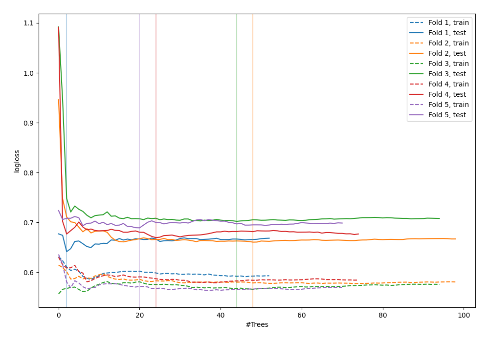

# Summary of 55_ExtraTrees

[<< Go back](../README.md)

## Extra Trees Classifier (Extra Trees)
- **n_jobs**: -1
- **criterion**: gini
- **max_features**: 0.6
- **min_samples_split**: 20
- **max_depth**: 4
- **explain_level**: 0

## Validation
 - **validation_type**: kfold
 - **shuffle**: True
 - **stratify**: True
 - **k_folds**: 5

## Optimized metric
logloss

## Training time

4.3 seconds

## Metric details
|           |    score |   threshold |
|:----------|---------:|------------:|
| logloss   | 0.672635 |  nan        |
| auc       | 0.58941  |  nan        |
| f1        | 0.628571 |    0.326056 |
| accuracy  | 0.603834 |    0.54288  |
| precision | 0.8      |    0.643655 |
| recall    | 1        |    0.141226 |
| mcc       | 0.20221  |    0.54288  |

## Confusion matrix (at threshold=0.54288)
|                     |   Predicted as negative |   Predicted as positive |
|:--------------------|------------------------:|------------------------:|
| Labeled as negative |                     164 |                       9 |
| Labeled as positive |                     115 |                      25 |

## Learning curves

[<< Go back](../README.md)
