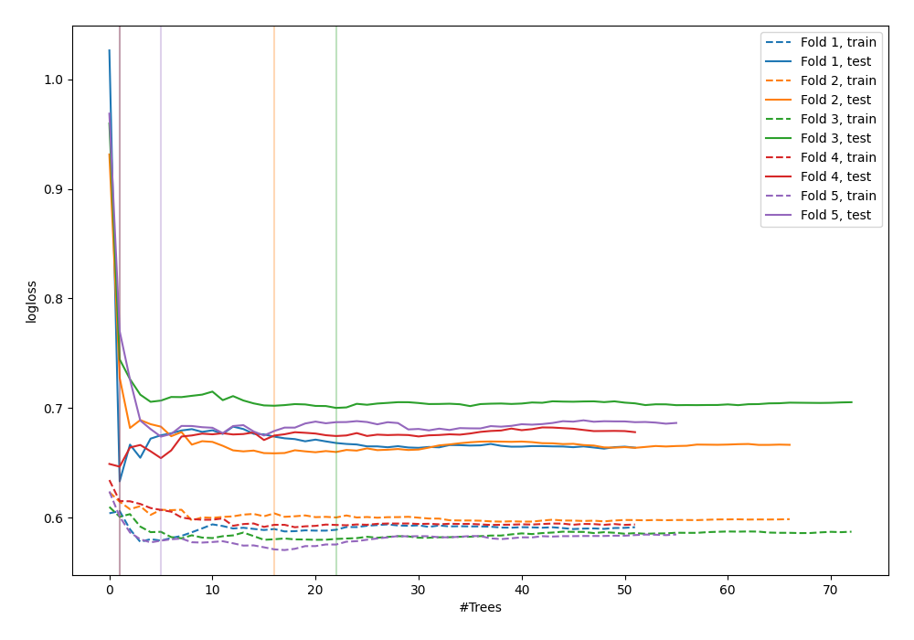

# Summary of 56_ExtraTrees

[<< Go back](../README.md)

## Extra Trees Classifier (Extra Trees)
- **n_jobs**: -1
- **criterion**: gini
- **max_features**: 0.5
- **min_samples_split**: 50
- **max_depth**: 5
- **explain_level**: 0

## Validation
 - **validation_type**: kfold
 - **shuffle**: True
 - **stratify**: True
 - **k_folds**: 5

## Optimized metric
logloss

## Training time

3.7 seconds

## Metric details
|           |    score |   threshold |
|:----------|---------:|------------:|
| logloss   | 0.662461 |  nan        |
| auc       | 0.618869 |  nan        |
| f1        | 0.639024 |    0.32811  |
| accuracy  | 0.623003 |    0.496735 |
| precision | 0.677419 |    0.584706 |
| recall    | 1        |    0.133784 |
| mcc       | 0.225637 |    0.496735 |

## Confusion matrix (at threshold=0.496735)
|                     |   Predicted as negative |   Predicted as positive |
|:--------------------|------------------------:|------------------------:|
| Labeled as negative |                     130 |                      43 |
| Labeled as positive |                      75 |                      65 |

## Learning curves

[<< Go back](../README.md)
