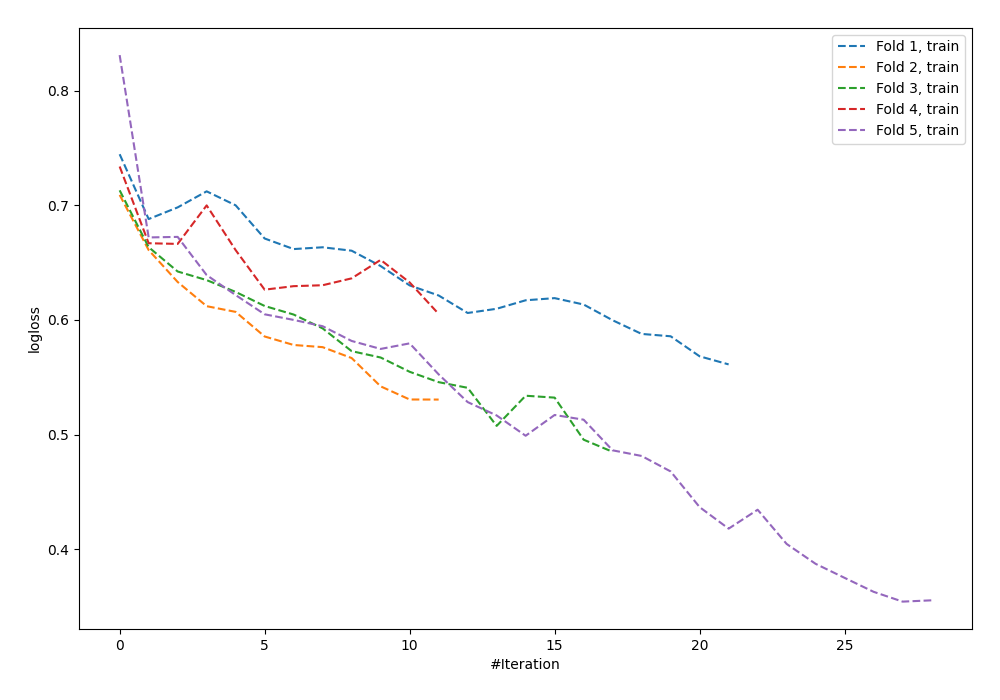

# Summary of 57_NeuralNetwork

[<< Go back](../README.md)

## Neural Network
- **n_jobs**: -1
- **dense_1_size**: 32
- **dense_2_size**: 4
- **learning_rate**: 0.05
- **explain_level**: 0

## Validation
 - **validation_type**: kfold
 - **shuffle**: True
 - **stratify**: True
 - **k_folds**: 5

## Optimized metric
logloss

## Training time

0.9 seconds

## Metric details
|           |    score |    threshold |
|:----------|---------:|-------------:|
| logloss   | 0.74109  | nan          |
| auc       | 0.555306 | nan          |
| f1        | 0.623025 |   0.035467   |
| accuracy  | 0.565495 |   0.539336   |
| precision | 0.714286 |   0.711596   |
| recall    | 1        |   0.00134781 |
| mcc       | 0.12785  |   0.396645   |

## Confusion matrix (at threshold=0.539336)
|                     |   Predicted as negative |   Predicted as positive |
|:--------------------|------------------------:|------------------------:|
| Labeled as negative |                     151 |                      22 |
| Labeled as positive |                     114 |                      26 |

## Learning curves

[<< Go back](../README.md)
